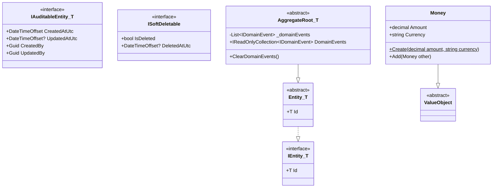
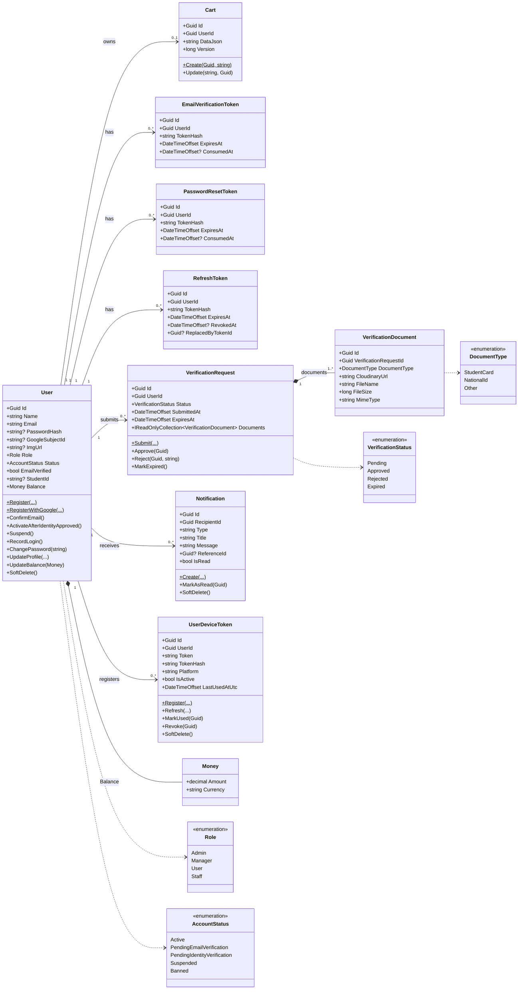
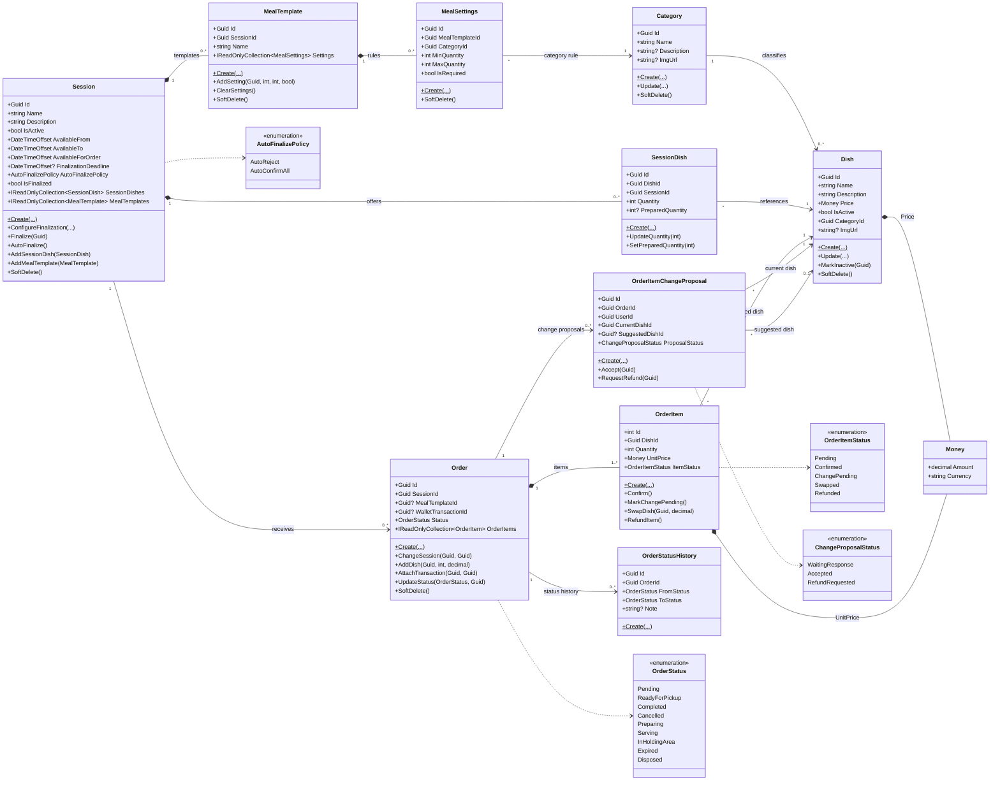
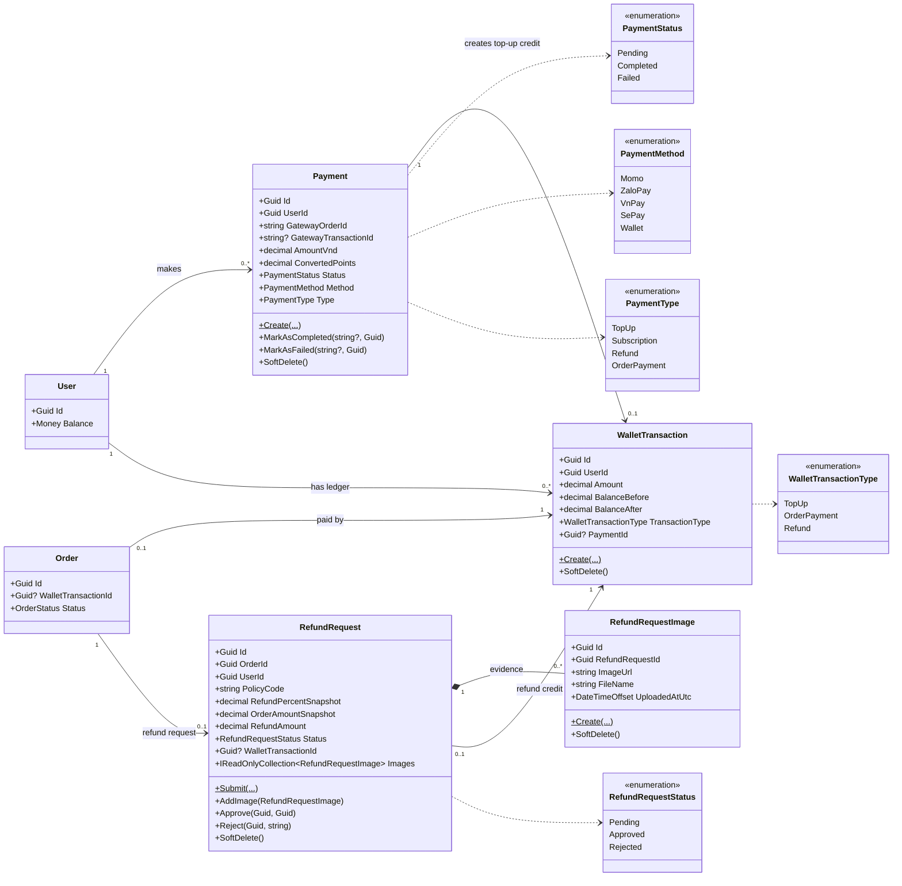
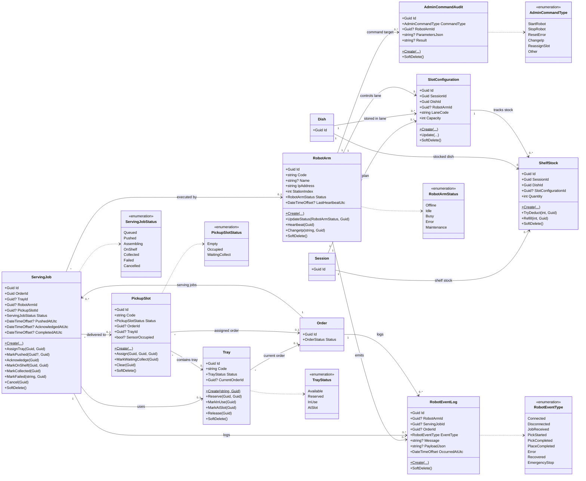
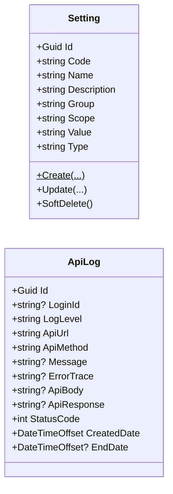
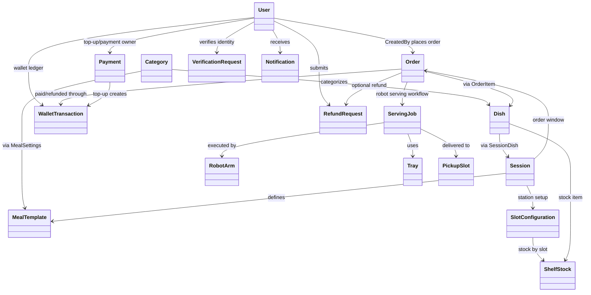

# SmartCanteen - Class Diagram

> Class diagram duoc tong hop tu `SC.Domain/Domain`, `SC.Domain/Abstraction` va cac EF Core configuration trong `SC.Persistence/Database/Configuration`.
> Cac quan he trong diagram bao gom ca navigation property truc tiep va cac lien ket thuc te thong qua foreign key `Guid`.

## 1. Core Abstractions

## 2. User, Authentication, Notification

## 3. Menu, Session, Order

## 4. Payment, Wallet, Refund

## 5. Robot Serving, Shelf, Pickup

## 6. Setting and Logging

## 7. Cross-Module Dependency Summary

## Notes

- `AggregateRoot<Guid>` va `Entity<T>` la lop nen cua hau het domain class.
- `Money` la value object duoc embed trong `User.Balance`, `Dish.Price`, `OrderItem.UnitPrice`.
- Mot so quan he trong code duoc bieu dien bang foreign key `Guid` thay vi navigation property, vi vay diagram dung mui ten association/dependency de phan anh quan he thuc te.
- `OrderItem` va `VerificationDocument` duoc EF Core cau hinh nhu owned/contained item cua aggregate cha.
- Cac class deu co audit fields (`CreatedAtUtc`, `UpdatedAtUtc`, `CreatedBy`, `UpdatedBy`) neu implement `IAuditableEntity<Guid>`; diagram chi hien thi trong nhung class quan trong de tranh qua tai.
