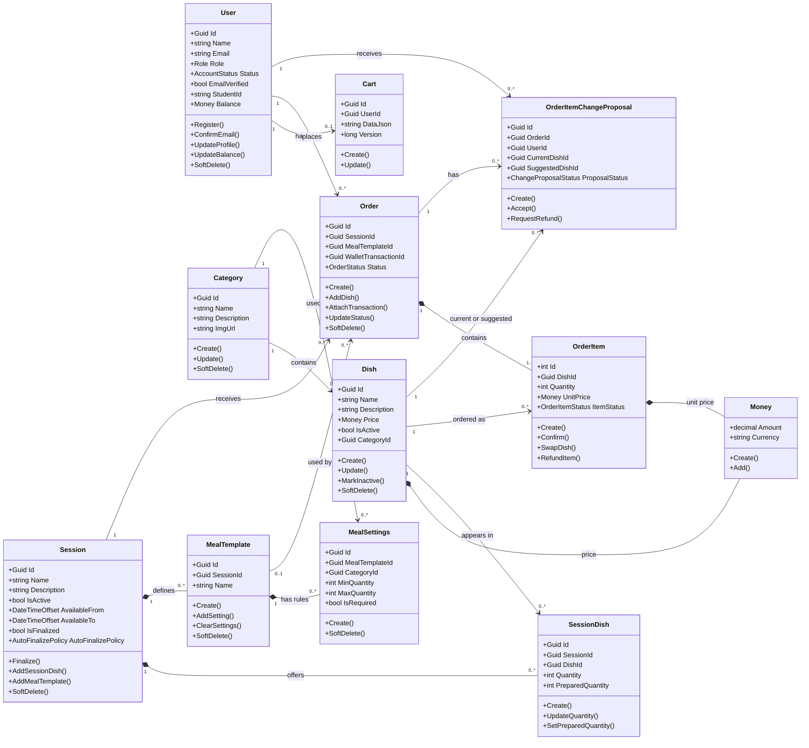
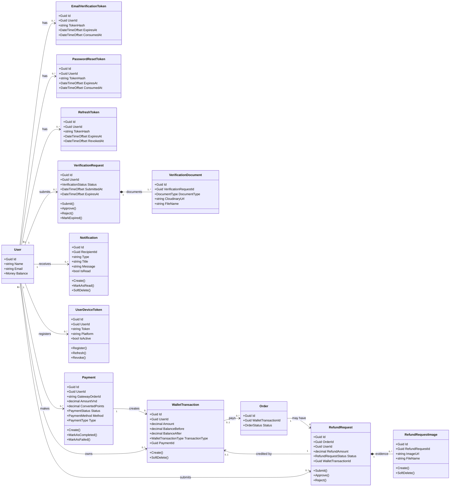
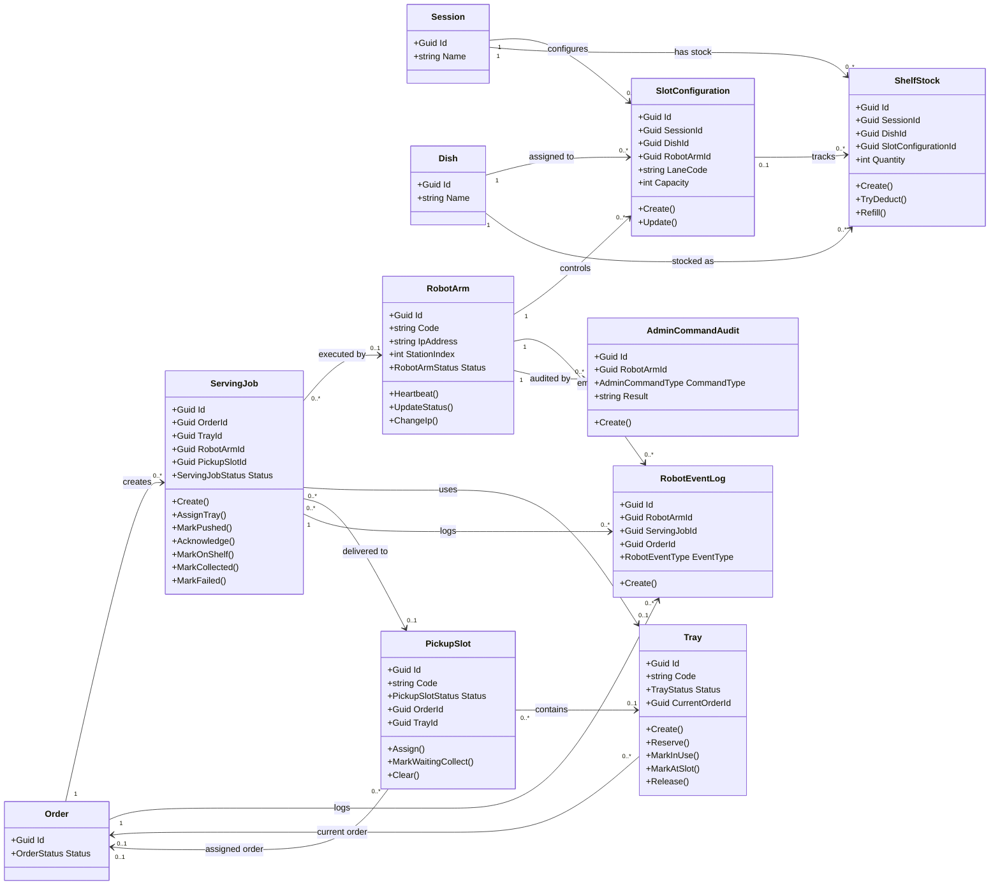

# SmartCanteen - Class Diagram Mermaid for draw.io

Copy one Mermaid block at a time into draw.io: `Insert` -> `Advanced` -> `Mermaid`.

## 1. Main Domain Class Diagram

## 2. Auth, Payment, Refund, Notification Class Diagram

## 3. Robot Serving Class Diagram

