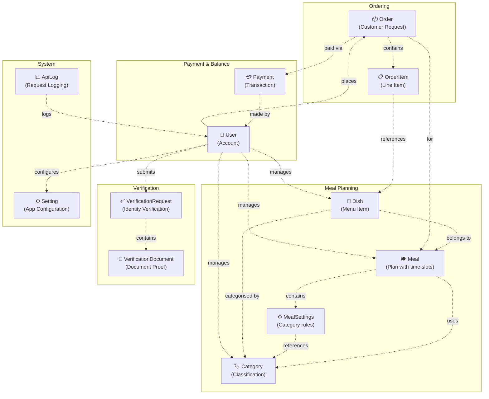

# SmartCanteen — Conceptual Diagram

> High-level business domain relationships derived from `SC.Domain/Domain`.

## Domain Summary

| Concept                  | DDD Stereotype | Key Responsibility                                                                                  |
| ------------------------ | -------------- | --------------------------------------------------------------------------------------------------- |
| **User**                 | Aggregate Root | Identity, authentication, balance, verification, profile info (student ID, major, DOB, phone)       |
| **Meal**                 | Aggregate Root | Meal plans with time-based availability and category-based settings                                 |
| **Dish**                 | Aggregate Root | Menu items with price, stock quantity, and categorisation                                           |
| **Order**                | Aggregate Root | Customer order linked to a meal, line items, and optional payment                                   |
| **Payment**              | Aggregate Root | Financial transactions, balance snapshots, payment method tracking                                  |
| **Category**             | Aggregate Root | Classification for dishes and meal settings                                                         |
| **Setting**              | Aggregate Root | Application-wide configuration key-value pairs                                                      |
| **VerificationRequest**  | Aggregate Root | Identity verification workflow with status tracking                                                 |
| **ApiLog**               | Aggregate Root | System logs for HTTP API requests, responses, and errors                                            |
| **Money**                | Value Object   | (Shared Kernel) Immutable monetary amount with currency                                             |
| **MealSettings**         | Value Object   | Category-quantity rules within a meal                                                               |
| **OrderItem**            | Value Object   | Line item: dish + quantity + unit price                                                             |
| **BalanceSnapshot**      | Value Object   | Before/after/delta balance for a payment transaction                                                |
| **VerificationDocument** | Value Object   | Document metadata: type, URL, file info, upload timestamp                                           |
| **Role**                 | Enum           | Admin(1) · Manager(2) · User(3)                                                                     |
| **UserCategory**         | Enum           | Student(1) · Lecturer(2) · Staff(3) · External(4)                                                   |
| **AccountStatus**        | Enum           | Active(1) · PendingEmailVerification(2) · PendingIdentityVerification(3) · Suspended(4) · Banned(5) |
| **Gender**               | Enum           | Male(1) · Female(2) · Other(3)                                                                      |
| **OrderStatus**          | Enum           | Pending(0) · ReadyForPickup(1) · Completed(2) · Cancelled(3)                                        |
| **PaymentStatus**        | Enum           | Pending(1) · Completed(2) · Failed(3)                                                               |
| **PaymentMethod**        | Enum           | Momo(1) · ZaloPay(2) · VnPay(3)                                                                     |
| **PaymentType**          | Enum           | TopUp(1) · Subscription(2) · Refund(3)                                                              |
| **DocumentType**         | Enum           | StudentCard(1) · NationalId(2) · Other(3)                                                           |
| **VerificationStatus**   | Enum           | Pending(1) · Approved(2) · Rejected(3) · Expired(4)                                                 |
