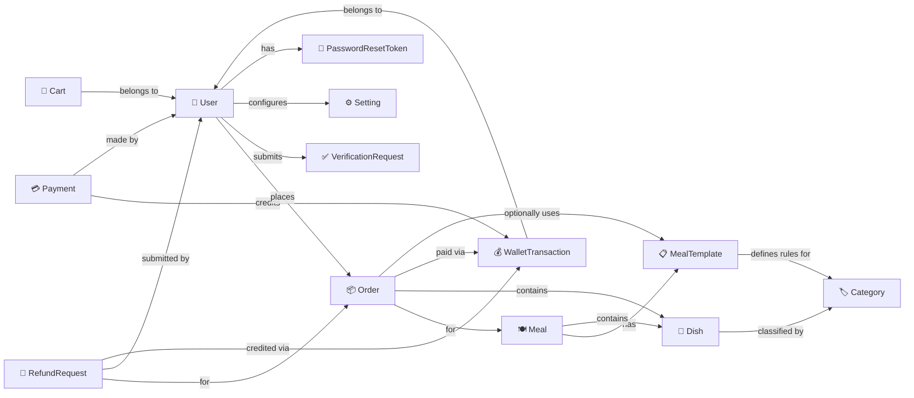

# SmartCanteen — Conceptual Diagram

> Core domain aggregates and their relationships.

## Domain Summary

| Concept               | DDD Stereotype | Key Responsibility                                                    |
| --------------------- | -------------- | --------------------------------------------------------------------- |
| **User**              | Aggregate Root | Identity, auth, wallet balance, profile, verification                 |
| **Meal**              | Aggregate Root | Time-bound meal plan with dish composition & customisation templates   |
| **MealTemplate**      | Entity         | Named template grouping category-quantity rules within a meal          |
| **Dish**              | Aggregate Root | Menu item with price, category, image                                  |
| **Category**          | Aggregate Root | Classification for dishes and meal settings                           |
| **Cart**              | Aggregate Root | Per-user shopping cart stored as JSON with optimistic concurrency      |
| **Order**             | Aggregate Root | Customer request linked to meal, line items, wallet transaction        |
| **Payment**           | Aggregate Root | Third-party gateway transaction tracking (top-up payments)             |
| **WalletTransaction** | Entity         | Immutable record of every wallet balance change (top-up, order, refund)|
| **RefundRequest**     | Aggregate Root | Customer refund claim with policy snapshots, images, and admin review  |
| **VerificationRequest** | Aggregate Root | Identity verification with document uploads and admin review         |
| **Setting**           | Aggregate Root | App-wide configuration key-value pairs (including refund policies)     |
| **PasswordResetToken** | Aggregate Root | Single-use time-limited token for password reset flow                 |
