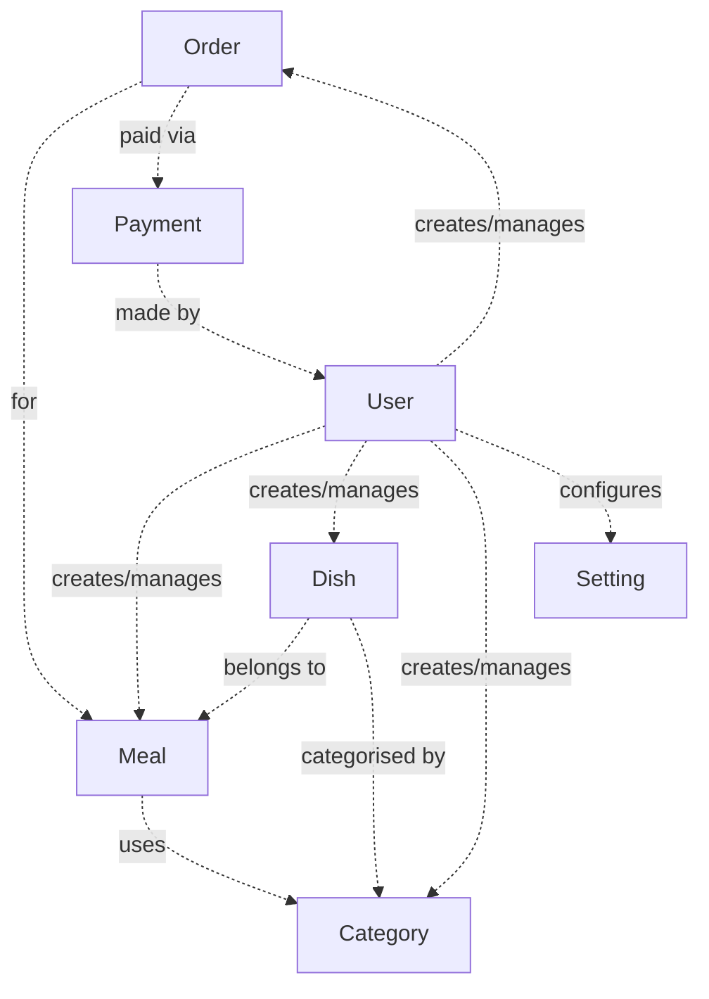

# SmartCanteen — Conceptual Diagram

> High-level business domain relationships derived from `SC.Domain/Domain`.

## Domain Summary

| Concept | DDD Stereotype | Key Responsibility |
|---------|---------------|-------------------|
| **User** | Aggregate Root | Manages identity, authentication, balance |
| **Meal** | Aggregate Root | Defines meal plans with category-based settings |
| **Dish** | Aggregate Root | Menu items with price, stock, and categorisation |
| **Order** | Aggregate Root | Customer order linked to a meal and its line items |
| **Payment** | Aggregate Root | Tracks financial transactions and balance changes |
| **Category** | Aggregate Root | Classification for dishes and meal settings |
| **Setting** | Aggregate Root | Application-wide configuration key-value pairs |
| **ApiLog** | Aggregate Root | System logs for HTTP API requests and responses |
| **Money** | Value Object | (Shared Kernel) Immutable monetary amount with currency |
| **MealSettings** | Value Object | Category-quantity rules within a meal |
| **OrderItem** | Value Object | Line item: dish + quantity + unit price |
| **BalanceSnapshot** | Value Object | Before/after balance for a payment |
| **Role** | Enum | Admin · Manager · User |
| **OrderStatus** | Enum | Pending · ReadyForPickup · Completed · Cancelled |
| **PaymentStatus** | Enum | Pending · Completed · Failed |
| **PaymentMethod** | Enum | Momo · ZaloPay · VnPay |
| **PaymentType** | Enum | TopUp · Subscription · Refund |
| **AppLogLevel** | Enum | System logging severity levels |
