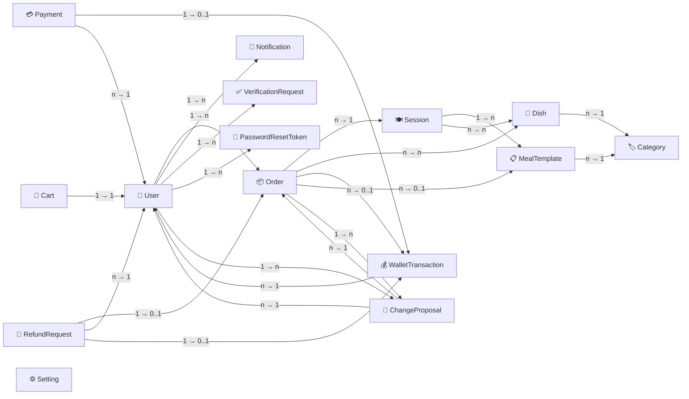

# SmartCanteen — Conceptual Diagram

> Core domain aggregates and their relationships with cardinality.

## Domain Summary

| Concept | DDD Stereotype | Key Responsibility |
|---------|---------------|-------------------|
| **User** | Aggregate Root | Identity, auth, wallet balance, profile, verification |
| **Session** | Aggregate Root | Time-bound meal plan with dish composition & customisation templates; finalization deadline & auto-finalize policy |
| **MealTemplate** | Entity | Named template grouping category-quantity rules within a session |
| **SessionDish** | Entity | Join entity linking a dish to a session with quantity and optional prepared-quantity |
| **Dish** | Aggregate Root | Menu item with price, category, image |
| **Category** | Aggregate Root | Classification for dishes and meal settings |
| **Cart** | Aggregate Root | Per-user shopping cart stored as JSON with optimistic concurrency |
| **Order** | Aggregate Root | Customer request linked to session, line items (with per-item status), wallet transaction |
| **OrderItem** | Entity (owned) | Line item within an order — dish, quantity, unit price, and item-level status (Pending/Confirmed/ChangePending/Swapped/Refunded) |
| **OrderItemChangeProposal** | Aggregate Root | Tracks a proposal to swap or refund an order item when manager cannot fulfil the ordered quantity |
| **Payment** | Aggregate Root | Third-party gateway transaction tracking (top-up payments) |
| **WalletTransaction** | Entity | Immutable record of every wallet balance change (top-up, order, refund) |
| **RefundRequest** | Aggregate Root | Customer refund claim with policy snapshots, images, and admin review |
| **VerificationRequest** | Aggregate Root | Identity verification with document uploads and admin review |
| **Setting** | Aggregate Root | App-wide configuration key-value pairs (including refund policies) |
| **Notification** | Aggregate Root | User notification record with type, title, message, metadata, and read status |
| **PasswordResetToken** | Aggregate Root | Single-use time-limited token for password reset flow |

## Relationships

| Source | Target | Cardinality | Description |
|--------|--------|-------------|-------------|
| Session | MealTemplate | 1 → * | A session can have many meal templates |
| Session | Dish | n → n | A session offers many dishes (via SessionDish) |
| Session | Order | 1 → * | A session contains many orders |
| Dish | Category | n → 1 | A dish belongs to one category |
| MealTemplate | Category | n → 1 | Templates reference categories for quantity rules |
| Cart | User | 1 → 1 | A user has exactly one cart |
| Order | Session | n → 1 | Orders belong to a session |
| Order | Dish | n → n | An order contains many dishes (via OrderItem) |
| Order | WalletTransaction | n → 0..1 | An order is optionally linked to a wallet debit |
| Order | MealTemplate | n → 0..1 | An order optionally uses a meal template |
| Order | ChangeProposal | 1 → n | An order can have many change proposals |
| ChangeProposal | Order | n → 1 | A proposal targets an order |
| ChangeProposal | User | n → 1 | A proposal targets a user |
| Payment | WalletTransaction | 1 → 0..1 | A payment optionally creates a wallet transaction |
| Payment | User | n → 1 | A user makes many payments |
| WalletTransaction | User | n → 1 | Transactions belong to a user |
| RefundRequest | Order | 0..1 → 0..1 | An order has at most one active refund |
| RefundRequest | User | n → 1 | A user submits refund requests |
| RefundRequest | WalletTransaction | 0..1 → 1 | Approved refund links to a credit transaction |
| User | Order | 1 → n | A user places orders |
| User | Notification | 1 → n | A user receives notifications |
| User | VerificationRequest | 1 → n | A user submits verification requests |
| User | PasswordResetToken | 1 → n | A user has password reset tokens |
| User | ChangeProposal | 1 → n | A user receives change proposals |
