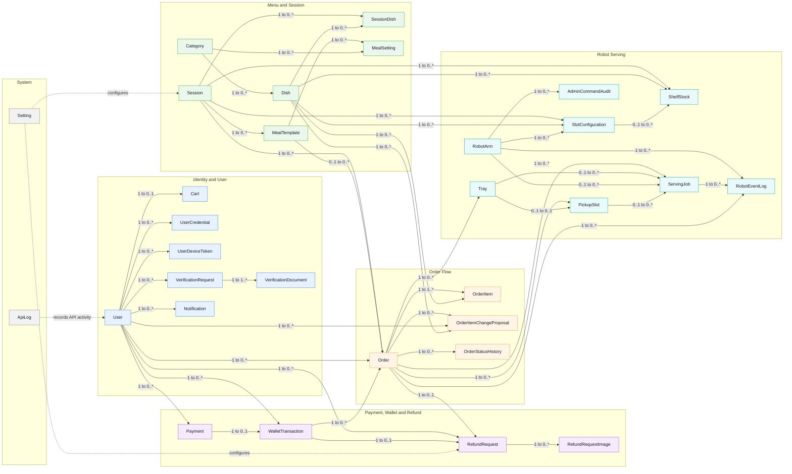

# SmartCanteen - Conceptual Diagram for draw.io Mermaid

Paste the Mermaid code below into draw.io: `Insert` -> `Advanced` -> `Mermaid`.

```mermaid
flowchart LR
    %% SmartCanteen Conceptual Diagram
    %% Cardinality labels:
    %% 1 to 0..* = one parent can have zero or many children
    %% 0..1 = optional one
    %% * = many

    subgraph Identity["Identity and User"]
        User["User"]
        Cart["Cart"]
        UserCredential["UserCredential"]
        UserDeviceToken["UserDeviceToken"]
        VerificationRequest["VerificationRequest"]
        VerificationDocument["VerificationDocument"]
        Notification["Notification"]
    end

    subgraph MenuSession["Menu and Session"]
        Category["Category"]
        Dish["Dish"]
        Session["Session"]
        SessionDish["SessionDish"]
        MealTemplate["MealTemplate"]
        MealSetting["MealSetting"]
    end

    subgraph OrderFlow["Order Flow"]
        Order["Order"]
        OrderItem["OrderItem"]
        ChangeProposal["OrderItemChangeProposal"]
        OrderStatusHistory["OrderStatusHistory"]
    end

    subgraph PaymentRefund["Payment, Wallet and Refund"]
        Payment["Payment"]
        WalletTransaction["WalletTransaction"]
        RefundRequest["RefundRequest"]
        RefundRequestImage["RefundRequestImage"]
    end

    subgraph RobotServing["Robot Serving"]
        RobotArm["RobotArm"]
        SlotConfiguration["SlotConfiguration"]
        ShelfStock["ShelfStock"]
        ServingJob["ServingJob"]
        Tray["Tray"]
        PickupSlot["PickupSlot"]
        RobotEventLog["RobotEventLog"]
        AdminCommandAudit["AdminCommandAudit"]
    end

    subgraph System["System"]
        Setting["Setting"]
        ApiLog["ApiLog"]
    end

    %% Identity and user relations
    User -->|"1 to 0..1"| Cart
    User -->|"1 to 0..*"| UserCredential
    User -->|"1 to 0..*"| UserDeviceToken
    User -->|"1 to 0..*"| VerificationRequest
    VerificationRequest -->|"1 to 1..*"| VerificationDocument
    User -->|"1 to 0..*"| Notification

    %% Menu and session relations
    Category -->|"1 to 0..*"| Dish
    Session -->|"1 to 0..*"| SessionDish
    Dish -->|"1 to 0..*"| SessionDish
    Session -->|"1 to 0..*"| MealTemplate
    MealTemplate -->|"1 to 0..*"| MealSetting
    Category -->|"1 to 0..*"| MealSetting

    %% Order relations
    User -->|"1 to 0..*"| Order
    Session -->|"1 to 0..*"| Order
    MealTemplate -->|"0..1 to 0..*"| Order
    Order -->|"1 to 1..*"| OrderItem
    Dish -->|"1 to 0..*"| OrderItem
    Order -->|"1 to 0..*"| ChangeProposal
    User -->|"1 to 0..*"| ChangeProposal
    Dish -->|"1 to 0..*"| ChangeProposal
    Order -->|"1 to 0..*"| OrderStatusHistory

    %% Payment, wallet and refund relations
    User -->|"1 to 0..*"| Payment
    User -->|"1 to 0..*"| WalletTransaction
    Payment -->|"1 to 0..1"| WalletTransaction
    WalletTransaction -->|"1 to 0..*"| Order
    Order -->|"1 to 0..1"| RefundRequest
    User -->|"1 to 0..*"| RefundRequest
    WalletTransaction -->|"1 to 0..1"| RefundRequest
    RefundRequest -->|"1 to 0..*"| RefundRequestImage

    %% Robot serving relations
    Session -->|"1 to 0..*"| SlotConfiguration
    Dish -->|"1 to 0..*"| SlotConfiguration
    RobotArm -->|"1 to 0..*"| SlotConfiguration
    Session -->|"1 to 0..*"| ShelfStock
    Dish -->|"1 to 0..*"| ShelfStock
    SlotConfiguration -->|"0..1 to 0..*"| ShelfStock

    Order -->|"1 to 0..*"| ServingJob
    Tray -->|"0..1 to 0..*"| ServingJob
    RobotArm -->|"0..1 to 0..*"| ServingJob
    PickupSlot -->|"0..1 to 0..*"| ServingJob
    Order -->|"1 to 0..*"| Tray
    Order -->|"1 to 0..*"| PickupSlot
    Tray -->|"0..1 to 0..1"| PickupSlot

    RobotArm -->|"1 to 0..*"| RobotEventLog
    ServingJob -->|"1 to 0..*"| RobotEventLog
    Order -->|"1 to 0..*"| RobotEventLog
    RobotArm -->|"1 to 0..*"| AdminCommandAudit

    %% Standalone system concepts
    Setting -.->|"configures"| Session
    Setting -.->|"configures"| RefundRequest
    ApiLog -.->|"records API activity"| User

    classDef identity fill:#E8F1FF,stroke:#2F80ED,color:#111827
    classDef menu fill:#EAF7EA,stroke:#27AE60,color:#111827
    classDef order fill:#FFF4E5,stroke:#F2994A,color:#111827
    classDef payment fill:#F5EAFE,stroke:#9B51E0,color:#111827
    classDef robot fill:#EAF9FA,stroke:#00A3A3,color:#111827
    classDef system fill:#F2F2F2,stroke:#828282,color:#111827

    class User,Cart,UserCredential,UserDeviceToken,VerificationRequest,VerificationDocument,Notification identity
    class Category,Dish,Session,SessionDish,MealTemplate,MealSetting menu
    class Order,OrderItem,ChangeProposal,OrderStatusHistory order
    class Payment,WalletTransaction,RefundRequest,RefundRequestImage payment
    class RobotArm,SlotConfiguration,ShelfStock,ServingJob,Tray,PickupSlot,RobotEventLog,AdminCommandAudit robot
    class Setting,ApiLog system
```
