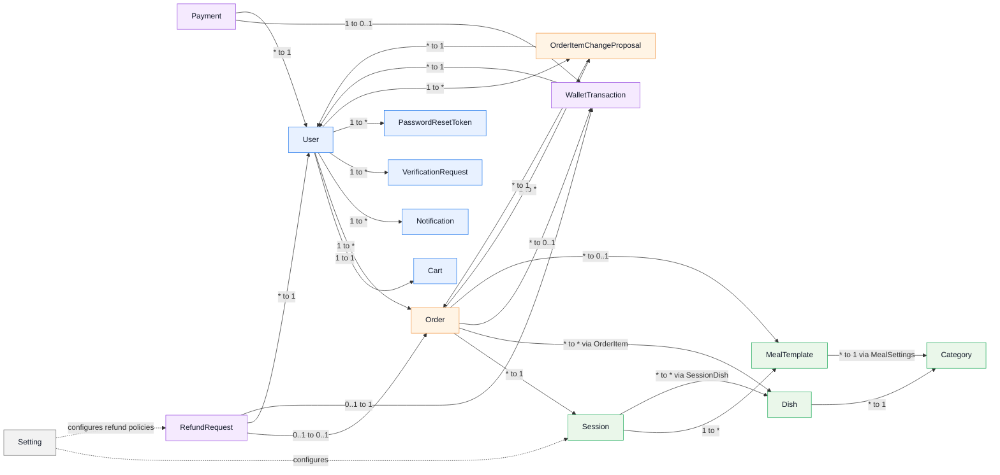
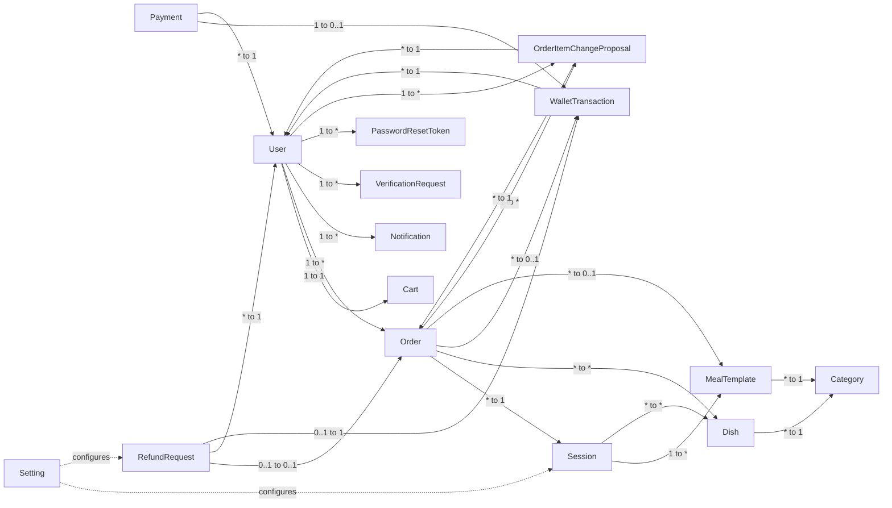

# SmartCanteen - Conceptual Model Mermaid

> Mermaid code based on `AI/conceptual_diagram.md`.
> Paste this into draw.io: `Insert` -> `Advanced` -> `Mermaid`.

## Compact Version

Use this version if draw.io renders the grouped/styled version too large.

