# SmartCanteen — ERD Diagram

> Entity-Relationship Diagram with full column-level detail, derived from `SC.Domain/Domain`.

```mermaid
erDiagram
    USER {
        Guid Id PK
        string Name
        string Email
        string PasswordHash "nullable"
        string GoogleSubjectId "nullable"
        string ImgUrl "nullable"
        int Role "Enum: Admin(1) Manager(2) User(3) Staff(4)"
        int Status "Enum: Active(1) PendingEmailVerification(2) PendingIdentityVerification(3) Suspended(4) Banned(5)"
        bool EmailVerified
        string StudentId "nullable"
        DateOnly DateOfBirth "nullable"
        string MajorOrClass "nullable"
        string PhoneNumber "nullable"
        string Address "nullable"
        int Gender "Enum: Male(1) Female(2) Other(3); nullable"
        DateTimeOffset LastLoginAt "nullable"
        decimal BalanceAmount "Value Object: Money"
        string BalanceCurrency "Value Object: Money"
        DateTimeOffset CreatedAtUtc
        DateTimeOffset UpdatedAtUtc "nullable"
        Guid CreatedBy
        Guid UpdatedBy
    }

    PASSWORD_RESET_TOKEN {
        Guid Id PK
        Guid UserId FK
        string TokenHash
        DateTimeOffset ExpiresAt
        DateTimeOffset ConsumedAt "nullable"
        DateTimeOffset CreatedAtUtc
        DateTimeOffset UpdatedAtUtc "nullable"
        Guid CreatedBy
        Guid UpdatedBy
    }

    REFRESH_TOKEN {
        Guid Id PK
        Guid UserId FK
        string TokenHash
        DateTimeOffset ExpiresAt
        DateTimeOffset RevokedAt "nullable"
        Guid ReplacedByTokenId "nullable"
        DateTimeOffset CreatedAtUtc
        DateTimeOffset UpdatedAtUtc "nullable"
        Guid CreatedBy
        Guid UpdatedBy
    }

    EMAIL_VERIFICATION_TOKEN {
        Guid Id PK
        Guid UserId FK
        string TokenHash
        DateTimeOffset ExpiresAt
        DateTimeOffset ConsumedAt "nullable"
        DateTimeOffset CreatedAtUtc
        DateTimeOffset UpdatedAtUtc "nullable"
        Guid CreatedBy
        Guid UpdatedBy
    }

    CART {
        Guid Id PK
        Guid UserId FK "unique, 1-to-1 with User"
        string DataJson "jsonb"
        long Version "concurrency token"
        DateTimeOffset CreatedAtUtc
        DateTimeOffset UpdatedAtUtc "nullable"
        Guid CreatedBy
        Guid UpdatedBy
    }

    CATEGORY {
        Guid Id PK
        string Name
        string Description
        string ImgUrl "nullable"
        DateTimeOffset CreatedAtUtc
        DateTimeOffset UpdatedAtUtc "nullable"
        Guid CreatedBy
        Guid UpdatedBy
    }

    DISH {
        Guid Id PK
        string Name
        string Description
        decimal PriceAmount "Value Object: Money"
        string PriceCurrency "Value Object: Money"
        bool IsActive
        string ImgUrl "nullable"
        Guid CategoryId FK
        DateTimeOffset CreatedAtUtc
        DateTimeOffset UpdatedAtUtc "nullable"
        Guid CreatedBy
        Guid UpdatedBy
    }

    DISH_MEAL {
        Guid DishId PK, FK
        Guid MealId PK, FK
        int Quantity "default 1"
    }

    MEAL {
        Guid Id PK
        string Name
        string Description
        bool IsActive
        DateTimeOffset AvailableFrom
        DateTimeOffset AvailableTo
        DateTimeOffset AvailableForOrder
        DateTimeOffset CreatedAtUtc
        DateTimeOffset UpdatedAtUtc "nullable"
        Guid CreatedBy
        Guid UpdatedBy
    }

    MEAL_TEMPLATE {
        Guid Id PK
        Guid MealId FK
        string Name
        DateTimeOffset CreatedAtUtc
        DateTimeOffset UpdatedAtUtc "nullable"
        Guid CreatedBy
        Guid UpdatedBy
    }

    MEAL_SETTINGS {
        Guid Id PK
        Guid MealTemplateId FK
        Guid CategoryId FK
        int MinQuantity
        int MaxQuantity
        bool IsRequired
        DateTimeOffset CreatedAtUtc
        DateTimeOffset UpdatedAtUtc "nullable"
        Guid CreatedBy
        Guid UpdatedBy
    }

    ORDER {
        Guid Id PK
        Guid MealId FK
        Guid MealTemplateId FK "nullable"
        Guid WalletTransactionId FK "nullable; replaces PaymentId"
        int Status "Enum: Pending(0) ReadyForPickup(1) Completed(2) Cancelled(3)"
        DateTimeOffset CreatedAtUtc
        DateTimeOffset UpdatedAtUtc "nullable"
        Guid CreatedBy
        Guid UpdatedBy
    }

    ORDER_ITEM {
        Guid OrderId PK, FK
        Guid DishId PK, FK
        int Quantity
        decimal UnitPriceAmount "Value Object: Money"
        string UnitPriceCurrency "Value Object: Money"
    }

    PAYMENT {
        Guid Id PK
        Guid UserId FK
        string GatewayOrderId "unique"
        string GatewayTransactionId "nullable; unique filtered"
        decimal AmountVnd
        decimal ConvertedPoints
        int Status "Enum: Pending(1) Completed(2) Failed(3)"
        int Method "Enum: Momo(1) ZaloPay(2) VnPay(3) SePay(4) Wallet(5)"
        int Type "Enum: TopUp(1) Subscription(2) Refund(3) OrderPayment(4)"
        string FailureReason "nullable"
        DateTimeOffset CreatedAtUtc
        DateTimeOffset UpdatedAtUtc "nullable"
        Guid CreatedBy
        Guid UpdatedBy
        DateTimeOffset CompletedAtUtc "nullable"
    }

    WALLET_TRANSACTION {
        Guid Id PK
        Guid UserId FK
        decimal Amount
        decimal BalanceBefore
        decimal BalanceAfter
        int TransactionType "Enum: TopUp(1) OrderPayment(2) Refund(3)"
        Guid PaymentId FK "nullable; unique filtered; links to top-up Payment"
        DateTimeOffset CreatedAtUtc
        DateTimeOffset UpdatedAtUtc "nullable"
        Guid CreatedBy
        Guid UpdatedBy
    }

    REFUND_REQUEST {
        Guid Id PK
        Guid OrderId FK "unique filtered where active"
        Guid UserId FK
        string PolicyCode
        string PolicyNameSnapshot "copied from Setting at submission"
        decimal RefundPercentSnapshot
        decimal OrderAmountSnapshot
        decimal RefundAmount "OrderAmount * RefundPercent / 100"
        string Description
        int Status "Enum: Pending(1) Approved(2) Rejected(3)"
        Guid ReviewedBy "nullable"
        DateTimeOffset ReviewedAtUtc "nullable"
        string RejectionReason "nullable"
        Guid WalletTransactionId FK "nullable; unique filtered; set on approve"
        DateTimeOffset CreatedAtUtc
        DateTimeOffset UpdatedAtUtc "nullable"
        Guid CreatedBy
        Guid UpdatedBy
    }

    REFUND_REQUEST_IMAGE {
        Guid Id PK
        Guid RefundRequestId FK
        string ImageUrl
        string FileName
        DateTimeOffset UploadedAtUtc
        DateTimeOffset CreatedAtUtc
        DateTimeOffset UpdatedAtUtc "nullable"
        Guid CreatedBy
        Guid UpdatedBy
    }

    VERIFICATION_REQUEST {
        Guid Id PK
        Guid UserId FK
        int Status "Enum: Pending(1) Approved(2) Rejected(3) Expired(4)"
        DateTimeOffset SubmittedAt
        DateTimeOffset ReviewedAt "nullable"
        Guid ReviewedBy "nullable"
        string RejectionReason "nullable"
        DateTimeOffset ExpiresAt
        DateTimeOffset CreatedAtUtc
        DateTimeOffset UpdatedAtUtc "nullable"
        Guid CreatedBy
        Guid UpdatedBy
    }

    VERIFICATION_DOCUMENT {
        Guid Id PK
        Guid VerificationRequestId PK, FK
        int DocumentType "Enum: StudentCard(1) NationalId(2) Other(3)"
        string CloudinaryUrl
        string FileName
        long FileSize
        string MimeType
        DateTimeOffset UploadedAt
    }

    SETTING {
        Guid Id PK
        string Code
        string Name
        string Description
        string Group
        string Scope
        string Value
        string Type
        DateTimeOffset CreatedAtUtc
        DateTimeOffset UpdatedAtUtc "nullable"
        Guid CreatedBy
        Guid UpdatedBy
    }

    API_LOG {
        Guid Id PK
        string LoginId "nullable"
        string LogLevel
        string ApiUrl
        string ApiMethod
        string Message "nullable"
        string ErrorTrace "nullable"
        string ApiBody "nullable"
        string ApiResponse "nullable"
        string LocalIpAddress "nullable"
        string LocalHostPC "nullable"
        string LogApp "nullable"
        string LogVersion "nullable"
        string Memo "nullable"
        string RequestId "nullable"
        string ApiDesc "nullable"
        string ApiVer "nullable"
        DateTimeOffset CreatedDate
        DateTimeOffset EndDate "nullable"
    }

    %% ── User ──
    USER ||--o{ PASSWORD_RESET_TOKEN : "has"
    USER ||--o{ REFRESH_TOKEN : "has"
    USER ||--o{ EMAIL_VERIFICATION_TOKEN : "has"
    USER ||--o| CART : "has"
    USER ||--o{ PAYMENT : "makes"
    USER ||--o{ WALLET_TRANSACTION : "has"
    USER ||--o{ ORDER : "places"
    USER ||--o{ REFUND_REQUEST : "submits"
    USER ||--o{ VERIFICATION_REQUEST : "submits"

    %% ── Category ──
    CATEGORY ||--o{ DISH : "classifies"
    CATEGORY ||--o{ MEAL_SETTINGS : "referenced in"

    %% ── Dish ↔ Meal (many-to-many via DishMeal) ──
    DISH ||--o{ DISH_MEAL : "part of"
    MEAL ||--o{ DISH_MEAL : "contains"

    %% ── Meal → MealTemplate → MealSettings ──
    MEAL ||--o{ MEAL_TEMPLATE : "has"
    MEAL_TEMPLATE ||--o{ MEAL_SETTINGS : "defines"

    %% ── Order ──
    MEAL ||--o{ ORDER : "ordered as"
    MEAL_TEMPLATE ||--o{ ORDER : "optionally used by"
    ORDER ||--o{ ORDER_ITEM : "contains"
    DISH ||--o{ ORDER_ITEM : "referenced by"
    ORDER ||--o| WALLET_TRANSACTION : "paid via"

    %% ── Payment → WalletTransaction (top-up flow) ──
    PAYMENT ||--o{ WALLET_TRANSACTION : "creates"

    %% ── Refund ──
    ORDER ||--o| REFUND_REQUEST : "has"
    REFUND_REQUEST ||--o{ REFUND_REQUEST_IMAGE : "contains"
    REFUND_REQUEST ||--o| WALLET_TRANSACTION : "credited via"

    %% ── Verification ──
    VERIFICATION_REQUEST ||--o{ VERIFICATION_DOCUMENT : "contains"
```

## Relationship Summary

| Parent                  | Child                    | Cardinality | FK Column(s)                   | Description                                              |
| ----------------------- | ------------------------ | ----------- | ------------------------------ | -------------------------------------------------------- |
| **User**                | **PasswordResetToken**   | 1 → \*      | `UserId`                       | A user can have many password reset tokens                |
| **User**                | **RefreshToken**         | 1 → \*      | `UserId`                       | A user can have many refresh tokens                       |
| **User**                | **EmailVerificationToken** | 1 → \*    | `UserId`                       | A user can have many email verification tokens            |
| **User**                | **Cart**                 | 1 → 0..1    | `UserId`                       | A user has at most one shopping cart                       |
| **User**                | **Payment**              | 1 → \*      | `UserId`                       | A user makes many payments                                |
| **User**                | **WalletTransaction**    | 1 → \*      | `UserId`                       | A user has many wallet transactions                       |
| **User**                | **Order**                | 1 → \*      | `CreatedBy`                    | A user places many orders                                 |
| **User**                | **RefundRequest**        | 1 → \*      | `UserId`                       | A user submits many refund requests                       |
| **User**                | **VerificationRequest**  | 1 → \*      | `UserId`                       | A user submits verification requests                      |
| **Category**            | **Dish**                 | 1 → \*      | `CategoryId`                   | A category classifies many dishes                         |
| **Category**            | **MealSettings**         | 1 → \*      | `CategoryId`                   | A category can appear in many meal settings               |
| **Dish**                | **DishMeal**             | 1 → \*      | `DishId`                       | A dish can be part of many meals                          |
| **Meal**                | **DishMeal**             | 1 → \*      | `MealId`                       | A meal contains many dishes                               |
| **Meal**                | **MealTemplate**         | 1 → \*      | `MealId`                       | A meal has many templates                                 |
| **MealTemplate**        | **MealSettings**         | 1 → \*      | `MealTemplateId`               | A template defines many category-quantity rules           |
| **Meal**                | **Order**                | 1 → \*      | `MealId`                       | Orders are placed for a specific meal                     |
| **MealTemplate**        | **Order**                | 1 → \*      | `MealTemplateId`               | Orders optionally reference a meal template               |
| **Order**               | **OrderItem**            | 1 → \*      | `OrderId`                      | An order contains multiple line items                     |
| **Dish**                | **OrderItem**            | 1 → \*      | `DishId`                       | A dish can appear in many order items                     |
| **Order**               | **WalletTransaction**    | 0..1 → 1    | `WalletTransactionId`          | An order links to the wallet debit transaction            |
| **Order**               | **RefundRequest**        | 0..1 → 0..1 | `OrderId`                      | An order has at most one active refund request            |
| **Payment**             | **WalletTransaction**    | 1 → 0..1    | `PaymentId`                    | A payment optionally produces a wallet credit tx          |
| **RefundRequest**       | **RefundRequestImage**   | 1 → \*      | `RefundRequestId`              | A refund request contains multiple evidence images        |
| **RefundRequest**       | **WalletTransaction**    | 0..1 → 1    | `WalletTransactionId`          | An approved refund links to the wallet credit tx          |
| **VerificationRequest** | **VerificationDocument** | 1 → \*      | `VerificationRequestId`        | A verification request contains multiple documents        |

## Owned Value Objects (flattened into parent table)

| Value Object  | Owner                          | Columns                                         |
| ------------- | ------------------------------ | ----------------------------------------------- |
| **Money**     | User (Balance)                 | `BalanceAmount`, `BalanceCurrency`               |
| **Money**     | Dish (Price)                   | `PriceAmount`, `PriceCurrency`                   |
| **Money**     | OrderItem (UnitPrice)          | `UnitPriceAmount`, `UnitPriceCurrency`           |

## Enums (stored as integer columns)

| Enum                       | Values                                                                                                     | Used In                                    |
| -------------------------- | ---------------------------------------------------------------------------------------------------------- | ------------------------------------------ |
| **Role**                   | Admin (1), Manager (2), User (3), Staff (4)                                                                | User.Role                                  |
| **AccountStatus**          | Active (1), PendingEmailVerification (2), PendingIdentityVerification (3), Suspended (4), Banned (5)       | User.Status                                |
| **Gender**                 | Male (1), Female (2), Other (3)                                                                            | User.Gender                                |
| **OrderStatus**            | Pending (0), ReadyForPickup (1), Completed (2), Cancelled (3)                                              | Order.Status                               |
| **PaymentStatus**          | Pending (1), Completed (2), Failed (3)                                                                     | Payment.Status                             |
| **PaymentMethod**          | Momo (1), ZaloPay (2), VnPay (3), SePay (4), Wallet (5)                                                   | Payment.Method                             |
| **PaymentType**            | TopUp (1), Subscription (2), Refund (3), OrderPayment (4)                                                  | Payment.Type                               |
| **WalletTransactionType**  | TopUp (1), OrderPayment (2), Refund (3)                                                                    | WalletTransaction.TransactionType          |
| **RefundRequestStatus**    | Pending (1), Approved (2), Rejected (3)                                                                    | RefundRequest.Status                       |
| **VerificationStatus**     | Pending (1), Approved (2), Rejected (3), Expired (4)                                                       | VerificationRequest.Status                 |
| **DocumentType**           | StudentCard (1), NationalId (2), Other (3)                                                                 | VerificationDocument.DocumentType          |
| **UserCategory**           | Student (1), Lecturer (2), Staff (3), External (4) *(deprecated — column removed from User)*               | —                                          |
