# SmartCanteen — ERD Diagram

> Entity-Relationship Diagram with full column-level detail, derived from `SC.Domain/Domain`.

```mermaid
erDiagram
    USER {
        Guid Id PK
        string Name
        string Email
        string PasswordHash "nullable"
        string GoogleSubjectId "nullable"
        string ImgUrl "nullable"
        int Role "Enum: Admin(1) Manager(2) User(3) Staff(4)"
        int Status "Enum: Active(1) PendingEmailVerification(2) PendingIdentityVerification(3) Suspended(4) Banned(5)"
        bool EmailVerified
        string StudentId "nullable"
        DateOnly DateOfBirth "nullable"
        string MajorOrClass "nullable"
        string PhoneNumber "nullable"
        string Address "nullable"
        int Gender "Enum: Male(1) Female(2) Other(3); nullable"
        DateTimeOffset LastLoginAt "nullable"
        decimal BalanceAmount "Value Object: Money"
        string BalanceCurrency "Value Object: Money"
        DateTimeOffset CreatedAtUtc
        DateTimeOffset UpdatedAtUtc "nullable"
        Guid CreatedBy
        Guid UpdatedBy
        bool IsDeleted
        DateTimeOffset DeletedAtUtc "nullable"
    }

    PASSWORD_RESET_TOKEN {
        Guid Id PK
        Guid UserId FK
        string TokenHash
        DateTimeOffset ExpiresAt
        DateTimeOffset ConsumedAt "nullable"
        DateTimeOffset CreatedAtUtc
        DateTimeOffset UpdatedAtUtc "nullable"
        Guid CreatedBy
        Guid UpdatedBy
    }

    REFRESH_TOKEN {
        Guid Id PK
        Guid UserId FK
        string TokenHash
        DateTimeOffset ExpiresAt
        DateTimeOffset RevokedAt "nullable"
        Guid ReplacedByTokenId "nullable"
        DateTimeOffset CreatedAtUtc
        DateTimeOffset UpdatedAtUtc "nullable"
        Guid CreatedBy
        Guid UpdatedBy
    }

    EMAIL_VERIFICATION_TOKEN {
        Guid Id PK
        Guid UserId FK
        string TokenHash
        DateTimeOffset ExpiresAt
        DateTimeOffset ConsumedAt "nullable"
        DateTimeOffset CreatedAtUtc
        DateTimeOffset UpdatedAtUtc "nullable"
        Guid CreatedBy
        Guid UpdatedBy
    }

    CART {
        Guid Id PK
        Guid UserId FK "unique, 1-to-1 with User"
        string DataJson "jsonb"
        long Version "concurrency token"
        DateTimeOffset CreatedAtUtc
        DateTimeOffset UpdatedAtUtc "nullable"
        Guid CreatedBy
        Guid UpdatedBy
    }

    CATEGORY {
        Guid Id PK
        string Name
        string Description
        string ImgUrl "nullable"
        DateTimeOffset CreatedAtUtc
        DateTimeOffset UpdatedAtUtc "nullable"
        Guid CreatedBy
        Guid UpdatedBy
        bool IsDeleted
        DateTimeOffset DeletedAtUtc "nullable"
    }

    DISH {
        Guid Id PK
        string Name
        string Description
        decimal PriceAmount "Value Object: Money"
        string PriceCurrency "Value Object: Money"
        bool IsActive
        string ImgUrl "nullable"
        Guid CategoryId FK
        DateTimeOffset CreatedAtUtc
        DateTimeOffset UpdatedAtUtc "nullable"
        Guid CreatedBy
        Guid UpdatedBy
        bool IsDeleted
        DateTimeOffset DeletedAtUtc "nullable"
    }

    SESSION {
        Guid Id PK
        string Name
        string Description
        bool IsActive
        DateTimeOffset AvailableFrom
        DateTimeOffset AvailableTo
        DateTimeOffset AvailableForOrder
        DateTimeOffset FinalizationDeadline "nullable"
        int AutoFinalizePolicy "Enum: AutoReject(0) AutoConfirmAll(1); default 0"
        bool IsFinalized "default false"
        DateTimeOffset FinalizedAtUtc "nullable"
        DateTimeOffset CreatedAtUtc
        DateTimeOffset UpdatedAtUtc "nullable"
        Guid CreatedBy
        Guid UpdatedBy
        bool IsDeleted
        DateTimeOffset DeletedAtUtc "nullable"
    }

    SESSION_DISH {
        Guid Id PK
        Guid SessionId FK
        Guid DishId FK
        int Quantity "default 1"
        int PreparedQuantity "nullable; set during finalization"
    }

    MEAL_TEMPLATE {
        Guid Id PK
        Guid SessionId FK
        string Name
        DateTimeOffset CreatedAtUtc
        DateTimeOffset UpdatedAtUtc "nullable"
        Guid CreatedBy
        Guid UpdatedBy
        bool IsDeleted
        DateTimeOffset DeletedAtUtc "nullable"
    }

    MEAL_SETTINGS {
        Guid Id PK
        Guid MealTemplateId FK
        Guid CategoryId FK
        int MinQuantity
        int MaxQuantity
        bool IsRequired
        DateTimeOffset CreatedAtUtc
        DateTimeOffset UpdatedAtUtc "nullable"
        Guid CreatedBy
        Guid UpdatedBy
        bool IsDeleted
        DateTimeOffset DeletedAtUtc "nullable"
    }

    ORDER {
        Guid Id PK
        Guid SessionId FK
        Guid MealTemplateId FK "nullable"
        Guid WalletTransactionId FK "nullable"
        int Status "Enum: Pending(0) ReadyForPickup(1) Completed(2) Cancelled(3) Preparing(4) Serving(5) InHoldingArea(6) Expired(7) Disposed(8)"
        DateTimeOffset CreatedAtUtc
        DateTimeOffset UpdatedAtUtc "nullable"
        Guid CreatedBy
        Guid UpdatedBy
        bool IsDeleted
        DateTimeOffset DeletedAtUtc "nullable"
    }

    ORDER_ITEM {
        int Id PK "auto-increment"
        Guid OrderId FK
        Guid DishId
        int Quantity
        decimal UnitPriceAmount "Value Object: Money"
        string UnitPriceCurrency "Value Object: Money"
        int ItemStatus "Enum: Pending(0) Confirmed(1) ChangePending(2) Swapped(3) Refunded(4)"
    }

    ORDER_ITEM_CHANGE_PROPOSAL {
        Guid Id PK
        Guid OrderId FK
        Guid UserId FK
        Guid CurrentDishId
        Guid SuggestedDishId "nullable"
        int ProposalStatus "Enum: WaitingResponse(0) Accepted(1) RefundRequested(2)"
        DateTimeOffset CreatedAtUtc
        DateTimeOffset UpdatedAtUtc "nullable"
        Guid CreatedBy
        Guid UpdatedBy
    }

    PAYMENT {
        Guid Id PK
        Guid UserId FK
        string GatewayOrderId "unique"
        string GatewayTransactionId "nullable; unique filtered"
        decimal AmountVnd
        decimal ConvertedPoints
        int Status "Enum: Pending(1) Completed(2) Failed(3)"
        int Method "Enum: Momo(1) ZaloPay(2) VnPay(3) SePay(4) Wallet(5)"
        int Type "Enum: TopUp(1) Subscription(2) Refund(3) OrderPayment(4)"
        string FailureReason "nullable"
        DateTimeOffset CreatedAtUtc
        DateTimeOffset UpdatedAtUtc "nullable"
        Guid CreatedBy
        Guid UpdatedBy
        DateTimeOffset CompletedAtUtc "nullable"
        bool IsDeleted
        DateTimeOffset DeletedAtUtc "nullable"
    }

    WALLET_TRANSACTION {
        Guid Id PK
        Guid UserId FK
        decimal Amount
        decimal BalanceBefore
        decimal BalanceAfter
        int TransactionType "Enum: TopUp(1) OrderPayment(2) Refund(3)"
        Guid PaymentId FK "nullable; unique filtered"
        DateTimeOffset CreatedAtUtc
        DateTimeOffset UpdatedAtUtc "nullable"
        Guid CreatedBy
        Guid UpdatedBy
        bool IsDeleted
        DateTimeOffset DeletedAtUtc "nullable"
    }

    REFUND_REQUEST {
        Guid Id PK
        Guid OrderId FK "unique filtered where active"
        Guid UserId FK
        string PolicyCode
        string PolicyNameSnapshot
        decimal RefundPercentSnapshot
        decimal OrderAmountSnapshot
        decimal RefundAmount
        string Description
        int Status "Enum: Pending(1) Approved(2) Rejected(3)"
        Guid ReviewedBy "nullable"
        DateTimeOffset ReviewedAtUtc "nullable"
        string RejectionReason "nullable"
        Guid WalletTransactionId FK "nullable; unique filtered"
        DateTimeOffset CreatedAtUtc
        DateTimeOffset UpdatedAtUtc "nullable"
        Guid CreatedBy
        Guid UpdatedBy
        bool IsDeleted
        DateTimeOffset DeletedAtUtc "nullable"
    }

    REFUND_REQUEST_IMAGE {
        Guid Id PK
        Guid RefundRequestId FK
        string ImageUrl
        string FileName
        DateTimeOffset UploadedAtUtc
        DateTimeOffset CreatedAtUtc
        DateTimeOffset UpdatedAtUtc "nullable"
        Guid CreatedBy
        Guid UpdatedBy
        bool IsDeleted
        DateTimeOffset DeletedAtUtc "nullable"
    }

    VERIFICATION_REQUEST {
        Guid Id PK
        Guid UserId FK
        int Status "Enum: Pending(1) Approved(2) Rejected(3) Expired(4)"
        DateTimeOffset SubmittedAt
        DateTimeOffset ReviewedAt "nullable"
        Guid ReviewedBy "nullable"
        string RejectionReason "nullable"
        DateTimeOffset ExpiresAt
        DateTimeOffset CreatedAtUtc
        DateTimeOffset UpdatedAtUtc "nullable"
        Guid CreatedBy
        Guid UpdatedBy
    }

    VERIFICATION_DOCUMENT {
        Guid Id PK
        Guid VerificationRequestId PK, FK
        int DocumentType "Enum: StudentCard(1) NationalId(2) Other(3)"
        string CloudinaryUrl
        string FileName
        long FileSize
        string MimeType
        DateTimeOffset UploadedAt
    }

    SETTING {
        Guid Id PK
        string Code
        string Name
        string Description
        string Group
        string Scope
        string Value
        string Type
        DateTimeOffset CreatedAtUtc
        DateTimeOffset UpdatedAtUtc "nullable"
        Guid CreatedBy
        Guid UpdatedBy
        bool IsDeleted
        DateTimeOffset DeletedAtUtc "nullable"
    }

    NOTIFICATION {
        Guid Id PK
        Guid RecipientId FK
        string Type
        string Title
        string Message
        string ReferenceType "nullable"
        string ReferenceId "nullable"
        string ActionUrl "nullable"
        string MetadataJson "nullable; jsonb"
        bool IsRead "default false"
        DateTimeOffset CreatedAtUtc
        DateTimeOffset UpdatedAtUtc "nullable"
        Guid CreatedBy
        Guid UpdatedBy
        bool IsDeleted
        DateTimeOffset DeletedAtUtc "nullable"
    }

    USER_DEVICE_TOKEN {
        Guid Id PK
        Guid UserId FK
        string Token
        string Platform "nullable"
        bool IsActive "default true"
        DateTimeOffset LastUsedAtUtc
        DateTimeOffset CreatedAtUtc
        DateTimeOffset UpdatedAtUtc "nullable"
        Guid CreatedBy
        Guid UpdatedBy
        bool IsDeleted
        DateTimeOffset DeletedAtUtc "nullable"
    }

    API_LOG {
        Guid Id PK
        string LoginId "nullable"
        string LogLevel
        string ApiUrl
        string ApiMethod
        string Message "nullable"
        string ErrorTrace "nullable"
        string ApiBody "nullable"
        string ApiResponse "nullable"
        string LocalIpAddress "nullable"
        string LocalHostPC "nullable"
        string LogApp "nullable"
        string LogVersion "nullable"
        string Memo "nullable"
        string RequestId "nullable"
        string ApiDesc "nullable"
        string ApiVer "nullable"
        DateTimeOffset CreatedDate
        DateTimeOffset EndDate "nullable"
    }

    SERVING_JOB {
        Guid Id PK
        Guid OrderId FK
        int Status
        DateTimeOffset CreatedAtUtc
        DateTimeOffset UpdatedAtUtc "nullable"
        Guid CreatedBy
        Guid UpdatedBy
        bool IsDeleted
        DateTimeOffset DeletedAtUtc "nullable"
    }

    TRAY {
        Guid Id PK
        Guid OrderId FK
        string TrayCode
        DateTimeOffset CreatedAtUtc
        DateTimeOffset UpdatedAtUtc "nullable"
        Guid CreatedBy
        Guid UpdatedBy
        bool IsDeleted
        DateTimeOffset DeletedAtUtc "nullable"
    }

    PICKUP_SLOT {
        Guid Id PK
        Guid OrderId FK
        DateTimeOffset PickupTime
        DateTimeOffset CreatedAtUtc
        DateTimeOffset UpdatedAtUtc "nullable"
        Guid CreatedBy
        Guid UpdatedBy
        bool IsDeleted
        DateTimeOffset DeletedAtUtc "nullable"
    }

    ORDER_STATUS_HISTORY {
        Guid Id PK
        Guid OrderId FK
        int FromStatus
        int ToStatus
        string Note "nullable"
        DateTimeOffset CreatedAtUtc
        DateTimeOffset UpdatedAtUtc "nullable"
        Guid CreatedBy
        Guid UpdatedBy
        bool IsDeleted
        DateTimeOffset DeletedAtUtc "nullable"
    }

    %% ── User ──
    USER ||--o{ PASSWORD_RESET_TOKEN : "has"
    USER ||--o{ REFRESH_TOKEN : "has"
    USER ||--o{ EMAIL_VERIFICATION_TOKEN : "has"
    USER ||--o| CART : "has"
    USER ||--o{ PAYMENT : "makes"
    USER ||--o{ WALLET_TRANSACTION : "has"
    USER ||--o{ ORDER : "places"
    USER ||--o{ REFUND_REQUEST : "submits"
    USER ||--o{ VERIFICATION_REQUEST : "submits"
    USER ||--o{ NOTIFICATION : "receives"
    USER ||--o{ USER_DEVICE_TOKEN : "registers"
    USER ||--o{ ORDER_ITEM_CHANGE_PROPOSAL : "receives"

    %% ── Category ──
    CATEGORY ||--o{ DISH : "classifies"
    CATEGORY ||--o{ MEAL_SETTINGS : "referenced in"

    %% ── Session ──
    SESSION ||--o{ SESSION_DISH : "offers"
    SESSION ||--o{ MEAL_TEMPLATE : "has"
    SESSION ||--o{ ORDER : "contains"

    %% ── SessionDish ──
    SESSION_DISH }|--|| DISH : "references"

    %% ── MealTemplate ──
    MEAL_TEMPLATE ||--o{ MEAL_SETTINGS : "defines"

    %% ── Order ──
    ORDER ||--o{ ORDER_ITEM : "contains"
    ORDER ||--o{ ORDER_ITEM_CHANGE_PROPOSAL : "has"
    ORDER ||--o| WALLET_TRANSACTION : "paid via"

    %% ── Payment → WalletTransaction (top-up flow) ──
    PAYMENT ||--o| WALLET_TRANSACTION : "creates"

    %% ── Refund ──
    ORDER ||--o| REFUND_REQUEST : "has"
    REFUND_REQUEST ||--o{ REFUND_REQUEST_IMAGE : "contains"
    REFUND_REQUEST ||--o| WALLET_TRANSACTION : "credited via"

    %% ── Verification ──
    VERIFICATION_REQUEST ||--o{ VERIFICATION_DOCUMENT : "contains"

    %% ── Robot Arm ──
    ORDER ||--o{ SERVING_JOB : "has"
    ORDER ||--o{ TRAY : "assigned"
    ORDER ||--o{ PICKUP_SLOT : "assigned"
    ORDER ||--o{ ORDER_STATUS_HISTORY : "tracks"
```

## Relationship Summary

| Parent | Child | Cardinality | Description |
|--------|-------|-------------|-------------|
| **User** | PasswordResetToken | 1 → * | A user can have many password reset tokens |
| **User** | RefreshToken | 1 → * | A user can have many refresh tokens |
| **User** | EmailVerificationToken | 1 → * | A user can have many email verification tokens |
| **User** | Cart | 1 → 0..1 | A user has at most one shopping cart |
| **User** | Payment | 1 → * | A user makes many payments |
| **User** | WalletTransaction | 1 → * | A user has many wallet transactions |
| **User** | Order | 1 → * | A user places many orders (via CreatedBy) |
| **User** | RefundRequest | 1 → * | A user submits many refund requests |
| **User** | VerificationRequest | 1 → * | A user submits verification requests |
| **User** | Notification | 1 → * | A user receives many notifications |
| **User** | UserDeviceToken | 1 → * | A user registers many device tokens |
| **User** | OrderItemChangeProposal | 1 → * | A user receives proposals for order item changes |
| **Category** | Dish | 1 → * | A category classifies many dishes |
| **Category** | MealSettings | 1 → * | A category can appear in many meal settings |
| **Session** | SessionDish | 1 → * | A session offers many dishes |
| **Session** | MealTemplate | 1 → * | A session has many templates |
| **Session** | Order | 1 → * | A session contains many orders |
| **SessionDish** | Dish | * → 1 | A session dish references a dish |
| **MealTemplate** | MealSettings | 1 → * | A template defines many category-quantity rules |
| **Order** | OrderItem | 1 → * | An order contains multiple line items |
| **Order** | OrderItemChangeProposal | 1 → * | An order has many change proposals |
| **Order** | ServingJob | 1 → * | An order has many serving jobs |
| **Order** | Tray | 1 → * | An order is assigned many trays |
| **Order** | PickupSlot | 1 → * | An order has pickup slots |
| **Order** | OrderStatusHistory | 1 → * | An order has status change history |
| **Order** | WalletTransaction | 0..1 → 1 | An order links to the wallet debit transaction |
| **Order** | RefundRequest | 0..1 → 0..1 | An order has at most one active refund request |
| **Payment** | WalletTransaction | 1 → 0..1 | A payment optionally produces a wallet credit tx |
| **RefundRequest** | RefundRequestImage | 1 → * | A refund request contains multiple evidence images |
| **RefundRequest** | WalletTransaction | 0..1 → 1 | An approved refund links to the wallet credit tx |
| **VerificationRequest** | VerificationDocument | 1 → * | A verification request contains multiple documents |

## Owned Value Objects (flattened into parent table)

| Value Object | Owner | Columns |
|-------------|-------|---------|
| **Money** | User (Balance) | `BalanceAmount`, `BalanceCurrency` |
| **Money** | Dish (Price) | `PriceAmount`, `PriceCurrency` |
| **Money** | OrderItem (UnitPrice) | `UnitPriceAmount`, `UnitPriceCurrency` |
| **Money** | OrderItemChangeProposal | *none (amounts derived from Dish prices)* |

## Enums (stored as integer columns)

| Enum | Values | Used In |
|------|--------|---------|
| **Role** | Admin (1), Manager (2), User (3), Staff (4) | User.Role |
| **AccountStatus** | Active (1), PendingEmailVerification (2), PendingIdentityVerification (3), Suspended (4), Banned (5) | User.Status |
| **Gender** | Male (1), Female (2), Other (3) | User.Gender |
| **OrderStatus** | Pending (0), ReadyForPickup (1), Completed (2), Cancelled (3), Preparing (4), Serving (5), InHoldingArea (6), Expired (7), Disposed (8) | Order.Status |
| **OrderItemStatus** | Pending (0), Confirmed (1), ChangePending (2), Swapped (3), Refunded (4) | OrderItem.ItemStatus |
| **ChangeProposalStatus** | WaitingResponse (0), Accepted (1), RefundRequested (2) | OrderItemChangeProposal.ProposalStatus |
| **AutoFinalizePolicy** | AutoReject (0), AutoConfirmAll (1) | Session.AutoFinalizePolicy |
| **PaymentStatus** | Pending (1), Completed (2), Failed (3) | Payment.Status |
| **PaymentMethod** | Momo (1), ZaloPay (2), VnPay (3), SePay (4), Wallet (5) | Payment.Method |
| **PaymentType** | TopUp (1), Subscription (2), Refund (3), OrderPayment (4) | Payment.Type |
| **WalletTransactionType** | TopUp (1), OrderPayment (2), Refund (3) | WalletTransaction.TransactionType |
| **RefundRequestStatus** | Pending (1), Approved (2), Rejected (3) | RefundRequest.Status |
| **VerificationStatus** | Pending (1), Approved (2), Rejected (3), Expired (4) | VerificationRequest.Status |
| **DocumentType** | StudentCard (1), NationalId (2), Other (3) | VerificationDocument.DocumentType |
