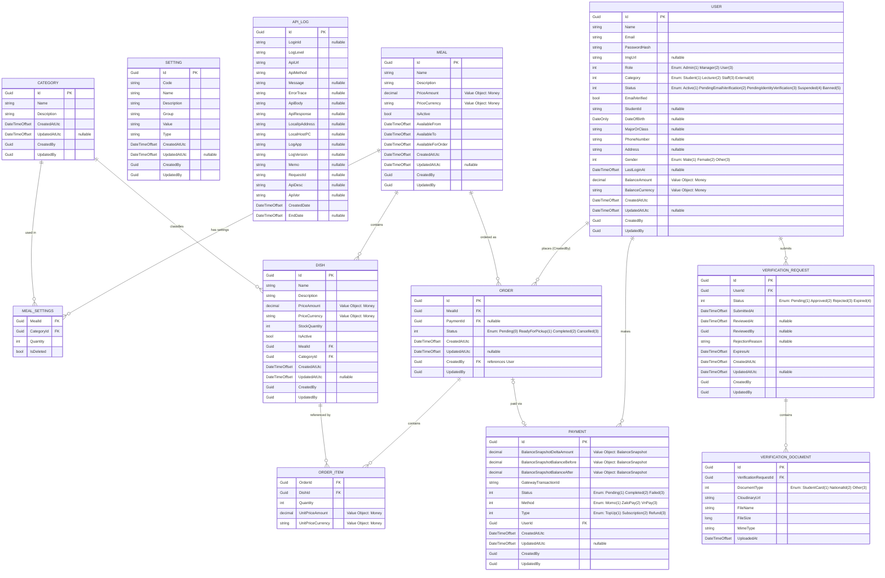

# SmartCanteen — ERD Diagram

> Entity-Relationship Diagram with full column-level detail, derived from `SC.Domain/Domain`.

## Relationship Summary

| Parent                  | Child                    | Cardinality | FK Column               | Description                                        |
| ----------------------- | ------------------------ | ----------- | ----------------------- | -------------------------------------------------- |
| **Meal**                | **MealSettings**         | 1 → \*      | `MealId`                | A meal defines category-quantity rules             |
| **Category**            | **MealSettings**         | 1 → \*      | `CategoryId`            | A category can appear in many meal settings        |
| **Meal**                | **Dish**                 | 1 → \*      | `MealId`                | A meal has many dishes                             |
| **Category**            | **Dish**                 | 1 → \*      | `CategoryId`            | A category classifies many dishes                  |
| **User**                | **Payment**              | 1 → \*      | `UserId`                | A user makes many payments                         |
| **User**                | **Order**                | 1 → \*      | `CreatedBy`             | A user places many orders                          |
| **Meal**                | **Order**                | 1 → \*      | `MealId`                | Orders are placed for a specific meal              |
| **Order**               | **OrderItem**            | 1 → \*      | `OrderId`               | An order contains multiple line items              |
| **Dish**                | **OrderItem**            | 1 → \*      | `DishId`                | A dish can appear in many order items              |
| **Payment**             | **Order**                | 0..1 → 0..1 | `PaymentId`             | An order may optionally be linked to a payment     |
| **User**                | **VerificationRequest**  | 1 → \*      | `UserId`                | A user submits verification requests               |
| **VerificationRequest** | **VerificationDocument** | 1 → \*      | `VerificationRequestId` | A verification request contains multiple documents |

## Owned Value Objects (flattened into parent table)

| Value Object        | Owner                 | Columns                                                                                     |
| ------------------- | --------------------- | ------------------------------------------------------------------------------------------- |
| **Money**           | User (Balance)        | `BalanceAmount`, `BalanceCurrency`                                                          |
| **Money**           | Meal (Price)          | `PriceAmount`, `PriceCurrency`                                                              |
| **Money**           | Dish (Price)          | `PriceAmount`, `PriceCurrency`                                                              |
| **Money**           | OrderItem (UnitPrice) | `UnitPriceAmount`, `UnitPriceCurrency`                                                      |
| **BalanceSnapshot** | Payment               | `BalanceSnapshotDeltaAmount`, `BalanceSnapshotBalanceBefore`, `BalanceSnapshotBalanceAfter` |

## Enums (stored as integer columns)

| Enum                   | Values                                                                                               | Used In                           |
| ---------------------- | ---------------------------------------------------------------------------------------------------- | --------------------------------- |
| **Role**               | Admin (1), Manager (2), User (3)                                                                     | User.Role                         |
| **UserCategory**       | Student (1), Lecturer (2), Staff (3), External (4)                                                   | User.Category                     |
| **AccountStatus**      | Active (1), PendingEmailVerification (2), PendingIdentityVerification (3), Suspended (4), Banned (5) | User.Status                       |
| **Gender**             | Male (1), Female (2), Other (3)                                                                      | User.Gender                       |
| **OrderStatus**        | Pending (0), ReadyForPickup (1), Completed (2), Cancelled (3)                                        | Order.Status                      |
| **PaymentStatus**      | Pending (1), Completed (2), Failed (3)                                                               | Payment.Status                    |
| **PaymentMethod**      | Momo (1), ZaloPay (2), VnPay (3)                                                                     | Payment.Method                    |
| **PaymentType**        | TopUp (1), Subscription (2), Refund (3)                                                              | Payment.Type                      |
| **DocumentType**       | StudentCard (1), NationalId (2), Other (3)                                                           | VerificationDocument.DocumentType |
| **VerificationStatus** | Pending (1), Approved (2), Rejected (3), Expired (4)                                                 | VerificationRequest.Status        |
