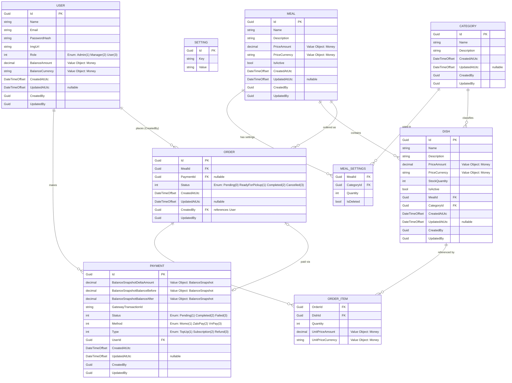

# SmartCanteen — ERD Diagram

> Entity-Relationship Diagram with full column-level detail, derived from `SC.Domain/Domain`.

## Relationship Summary

| Parent | Child | Cardinality | FK Column | Description |
|--------|-------|-------------|-----------|-------------|
| **Meal** | **MealSettings** | 1 → * | `MealId` | A meal defines category-quantity rules |
| **Category** | **MealSettings** | 1 → * | `CategoryId` | A category can appear in many meal settings |
| **Meal** | **Dish** | 1 → * | `MealId` | A meal has many dishes |
| **Category** | **Dish** | 1 → * | `CategoryId` | A category classifies many dishes |
| **User** | **Payment** | 1 → * | `UserId` | A user makes many payments |
| **User** | **Order** | 1 → * | `CreatedBy` | A user places many orders |
| **Meal** | **Order** | 1 → * | `MealId` | Orders are placed for a specific meal |
| **Order** | **OrderItem** | 1 → * | `OrderId` | An order contains multiple line items |
| **Dish** | **OrderItem** | 1 → * | `DishId` | A dish can appear in many order items |
| **Payment** | **Order** | 0..1 → 0..1 | `PaymentId` | An order may optionally be linked to a payment |

## Owned Value Objects (flattened into parent table)

| Value Object | Owner | Columns |
|-------------|-------|---------|
| **Money** | User (Balance) | `BalanceAmount`, `BalanceCurrency` |
| **Money** | Meal (Price) | `PriceAmount`, `PriceCurrency` |
| **Money** | Dish (Price) | `PriceAmount`, `PriceCurrency` |
| **Money** | OrderItem (UnitPrice) | `UnitPriceAmount`, `UnitPriceCurrency` |
| **BalanceSnapshot** | Payment | `BalanceSnapshotDeltaAmount`, `BalanceSnapshotBalanceBefore`, `BalanceSnapshotBalanceAfter` |

## Enums (stored as integer columns)

| Enum | Values | Used In |
|------|--------|---------|
| **Role** | Admin (1), Manager (2), User (3) | User.Role |
| **OrderStatus** | Pending (0), ReadyForPickup (1), Completed (2), Cancelled (3) | Order.Status |
| **PaymentStatus** | Pending (1), Completed (2), Failed (3) | Payment.Status |
| **PaymentMethod** | Momo (1), ZaloPay (2), VnPay (3) | Payment.Method |
| **PaymentType** | TopUp (1), Subscription (2), Refund (3) | Payment.Type |
