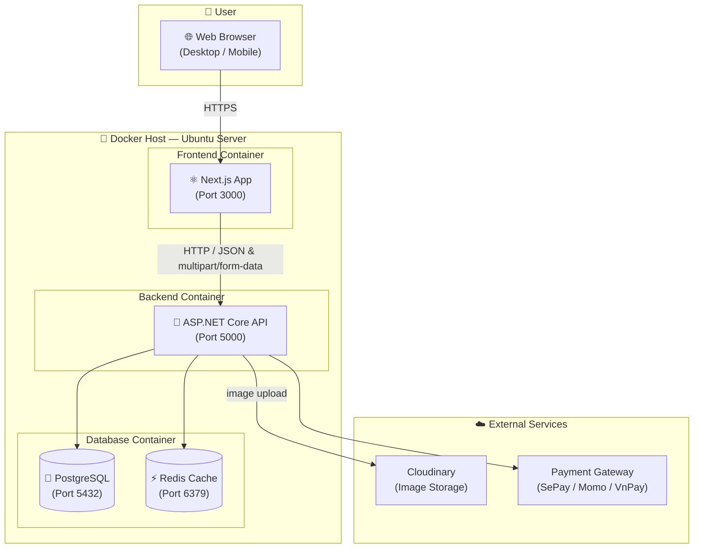

# SmartCanteen — System Architecture Diagram

> Frontend (Next.js) → Backend (ASP.NET on Ubuntu) → PostgreSQL, all containerised with Docker.



## Docker Compose Layout

```yaml
services:
  postgres:
    image: postgres:16
    ports: ["5432:5432"]
    volumes: ["pgdata:/var/lib/postgresql/data"]

  redis:
    image: redis:7
    ports: ["6379:6379"]

  backend:
    build: ./SC.Api
    ports: ["5000:8080"]
    depends_on: [postgres, redis]
    environment:
      - ConnectionStrings__DefaultConnection=Host=postgres;...

  frontend:
    build: ./frontend
    ports: ["3000:3000"]
    depends_on: [backend]
```

## Data Flow

| Step | From | To | Description |
|------|------|----|-------------|
| 1 | Browser | Next.js | User visits app, SSR renders page |
| 2 | Next.js | API | API calls with JWT Bearer token |
| 3 | API | PostgreSQL | CRUD via EF Core / Repository |
| 4 | API | Redis | Cache lookups, session data |
| 5 | API | Cloudinary | Upload image to Cloudinary, save returned URL |
| 6 | API | Payment GW | Create top-up, handle SePay IPN webhook |
