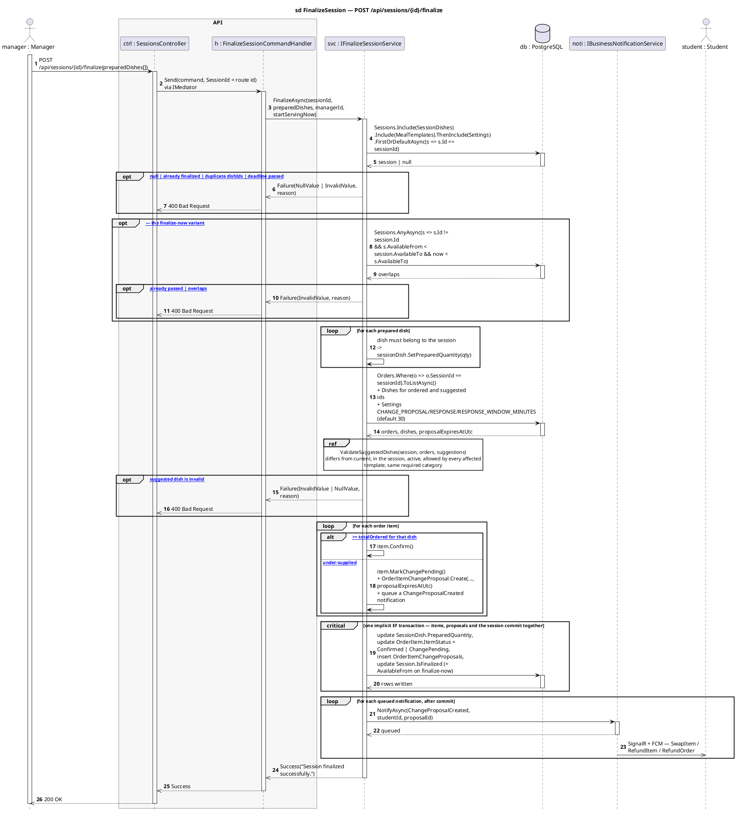

# 1 · POST /api/sessions/{id}/finalize

Corrected copy of `sd FinalizeSession — POST /api/sessions/{id}/finalize` from [`../sequence-diagrams/sessions-diagrams.md`](../sequence-diagrams/sessions-diagrams.md).

## What changed

- DB reply added after «update SessionDish.PreparedQuantity,\nupdate OrderIt»
- NOTI now returns to SVC and pushes to STU asynchronously

