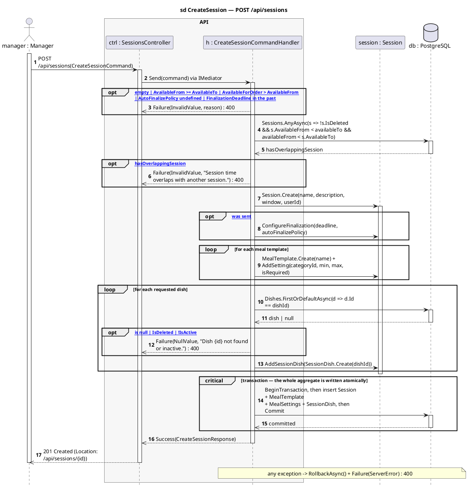

# 2 · POST /api/sessions

Corrected copy of `sd CreateSession — POST /api/sessions` from [`../sequence-diagrams/sessions-diagrams.md`](../sequence-diagrams/sessions-diagrams.md).

## What changed

- DB reply added after «BeginTransaction, then insert Session + MealTemplate»

