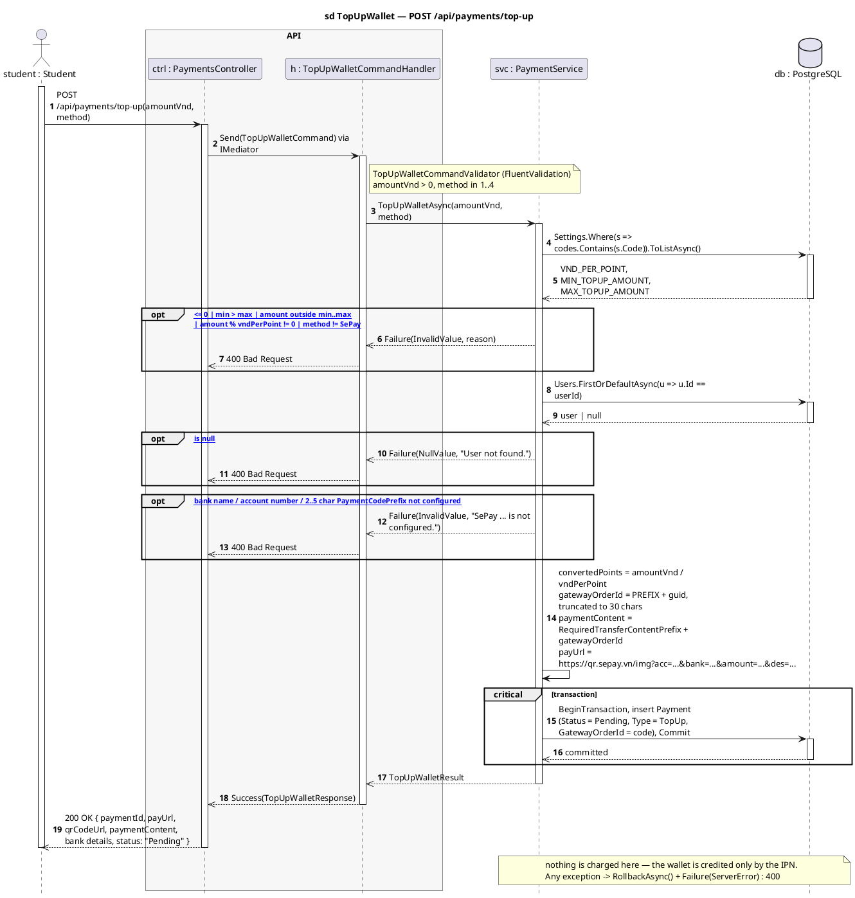

# 3 · POST /api/payments/top-up

Corrected copy of `sd TopUpWallet — POST /api/payments/top-up` from [`../sequence-diagrams/payments-diagrams.md`](../sequence-diagrams/payments-diagrams.md).

## What changed

- DB reply added after «BeginTransaction, insert Payment\n(Status = Pending,»

