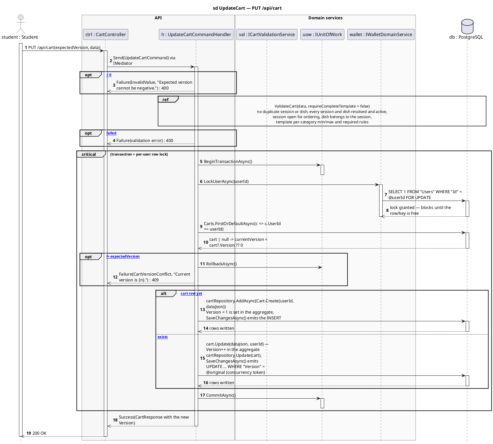

# 4 · PUT /api/cart

Corrected copy of `sd UpdateCart — PUT /api/cart` from [`../sequence-diagrams/cart-diagrams.md`](../sequence-diagrams/cart-diagrams.md).

## What changed

- DB reply added after «SELECT 1 FROM "Users" WHERE "Id" = @userId FOR UPDAT»
- DB reply added after «cartRepository.AddAsync(Cart.Create(userId, dataJson»
- DB reply added after «cart.Update(dataJson, userId) — Version++ in the agg»

