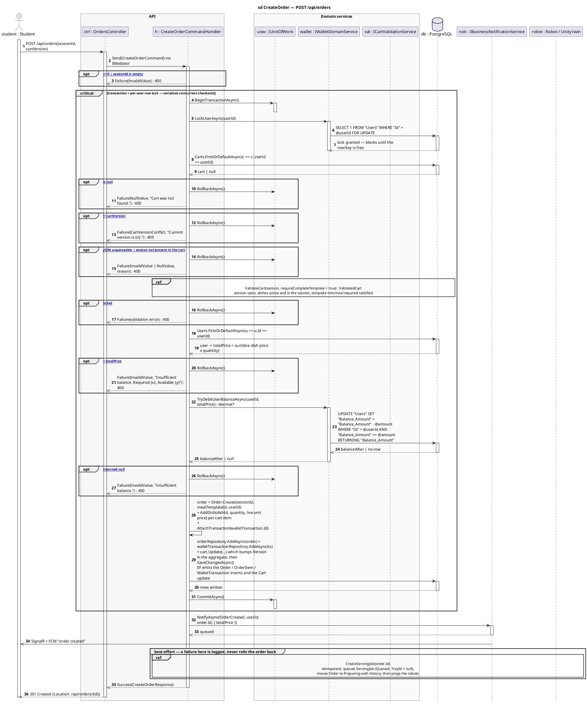

# 5 · POST /api/orders

Corrected copy of `sd CreateOrder — POST /api/orders` from [`../sequence-diagrams/orders-diagrams.md`](../sequence-diagrams/orders-diagrams.md).

## What changed

- DB reply added after «SELECT 1 FROM "Users" WHERE "Id" = @userId FOR UPDAT»
- DB reply added after «orderRepository.AddAsync(order) + walletTransactionR»
- NOTI now returns to H and pushes to STU asynchronously

