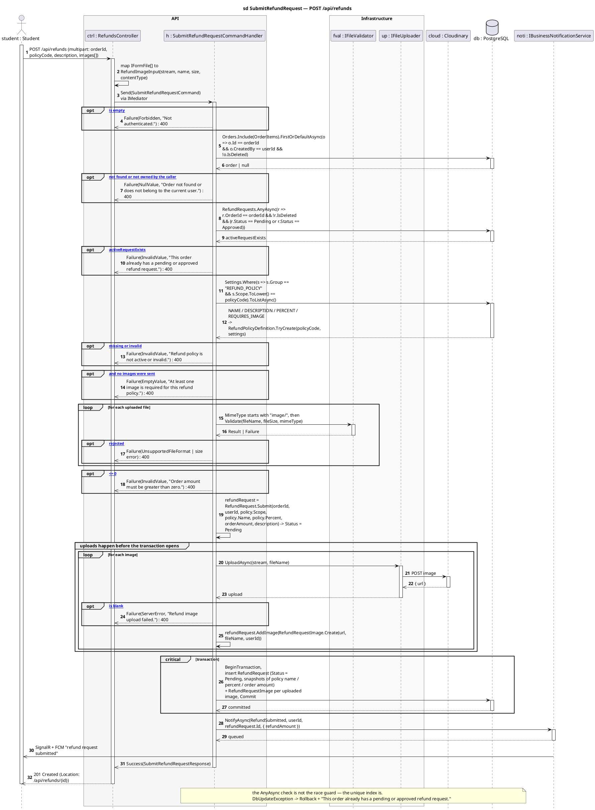

# 6 · POST /api/refunds

Corrected copy of `sd SubmitRefundRequest — POST /api/refunds` from [`../sequence-diagrams/refunds-diagrams.md`](../sequence-diagrams/refunds-diagrams.md).

## What changed

- DB reply added after «BeginTransaction,\ninsert RefundRequest (Status = Pe»
- NOTI now returns to H and pushes to STU asynchronously

