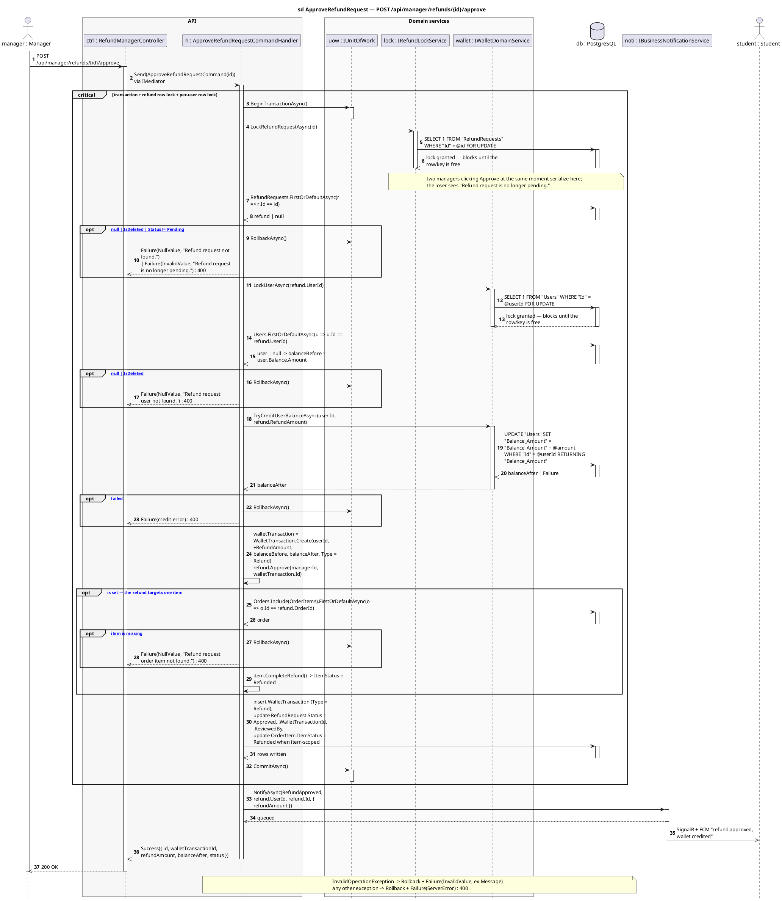

# 7 · POST /api/manager/refunds/{id}/approve

Corrected copy of `sd ApproveRefundRequest — POST /api/manager/refunds/{id}/approve` from [`../sequence-diagrams/refundmanager-diagrams.md`](../sequence-diagrams/refundmanager-diagrams.md).

## What changed

- DB reply added after «SELECT 1 FROM "RefundRequests" WHERE "Id" = @id FOR »
- DB reply added after «SELECT 1 FROM "Users" WHERE "Id" = @userId FOR UPDAT»
- DB reply added after «insert WalletTransaction (Type = Refund),\nupdate Re»
- NOTI now returns to H and pushes to STU asynchronously

