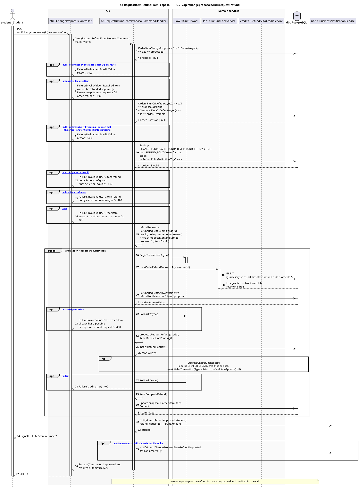

# 8 · POST /api/changeproposals/{id}/request-refund

Corrected copy of `sd RequestItemRefundFromProposal — POST /api/changeproposals/{id}/request-refund` from [`../sequence-diagrams/changeproposals-diagrams.md`](../sequence-diagrams/changeproposals-diagrams.md).

## What changed

- DB reply added after «SELECT pg_advisory_xact_lock(hashtext('refund-order-»
- DB reply added after «insert RefundRequest»
- DB reply added after «update proposal + order item, then Commit»
- NOTI now returns to H and pushes to STU asynchronously

