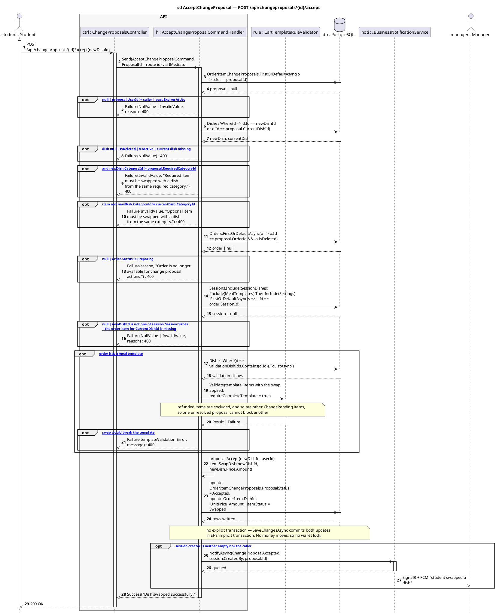

# 9 · POST /api/changeproposals/{id}/accept

Corrected copy of `sd AcceptChangeProposal — POST /api/changeproposals/{id}/accept` from [`../sequence-diagrams/changeproposals-diagrams.md`](../sequence-diagrams/changeproposals-diagrams.md).

## What changed

- DB reply added after «update OrderItemChangeProposals.ProposalStatus = Acc»
- NOTI now returns to H and pushes to MGR asynchronously

