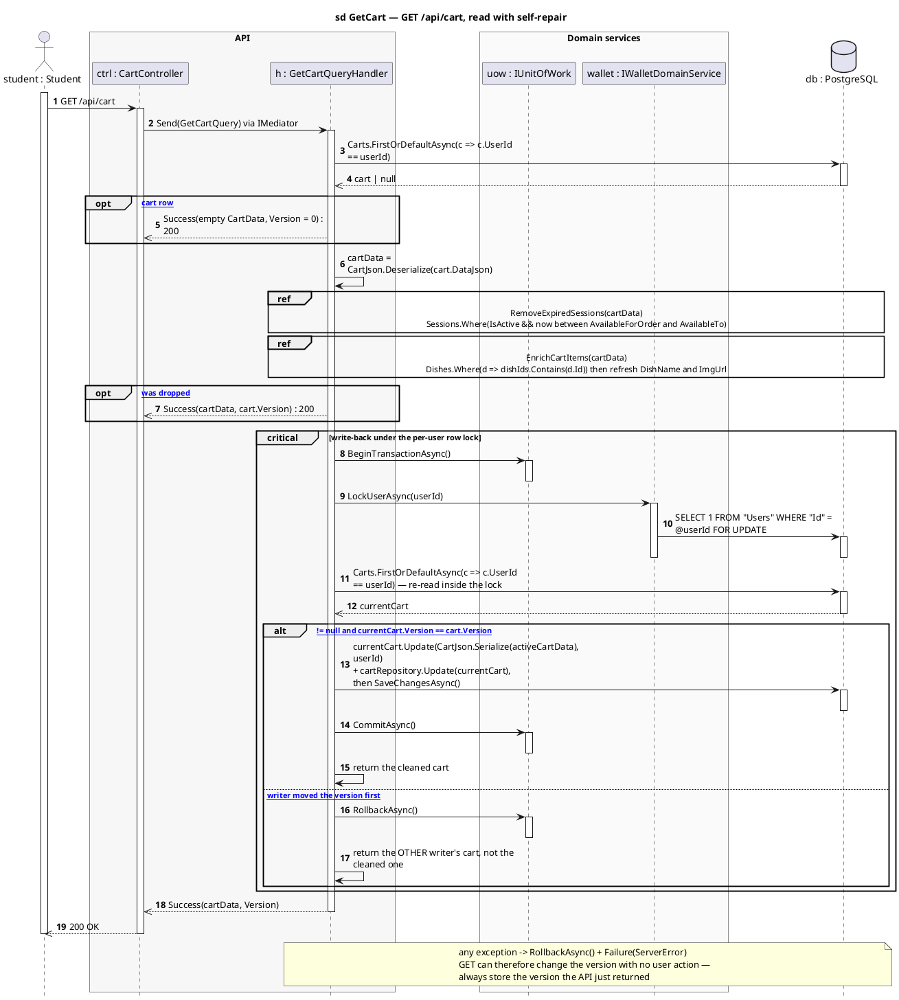
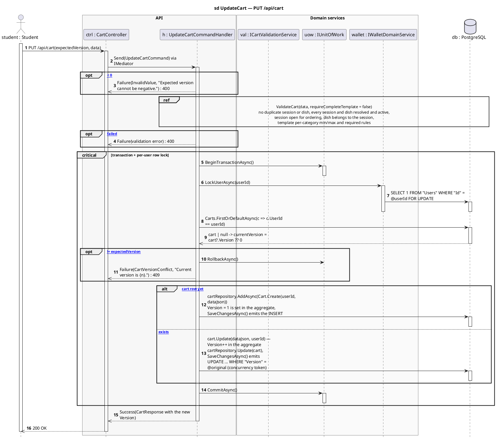
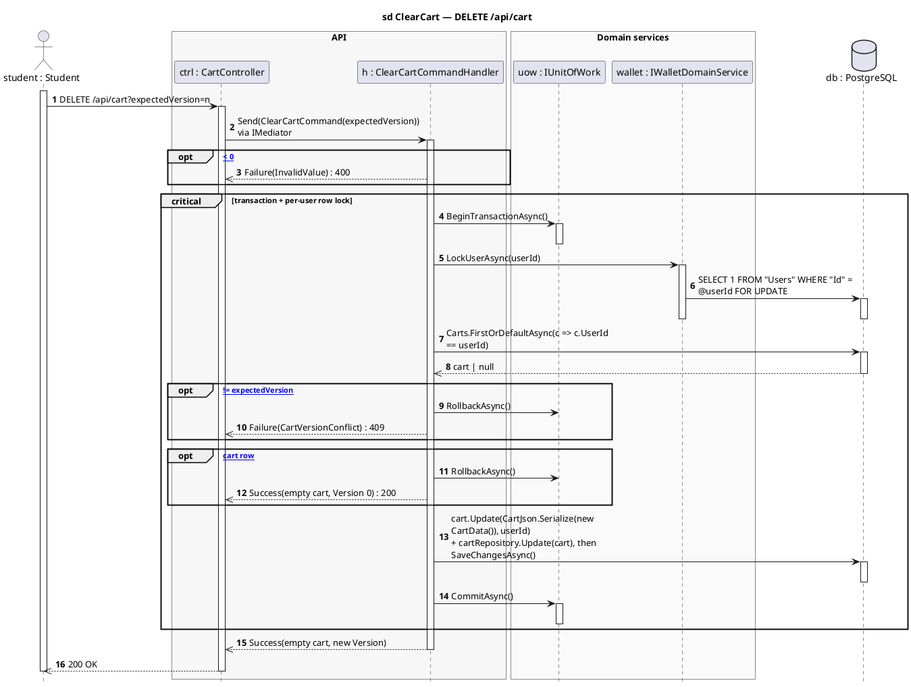
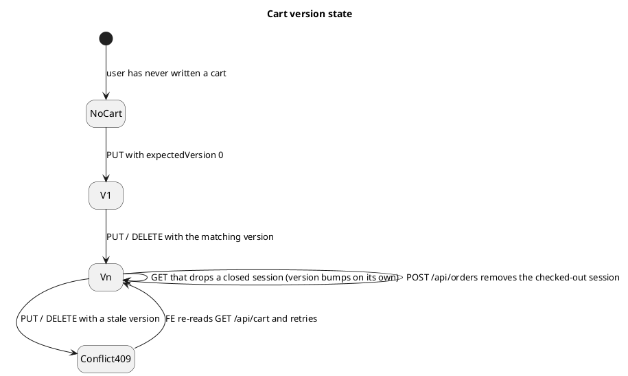

# CartController — Sequence Diagrams

Base route: **`/api/cart`** · Auth: **JWT (any authenticated user)** · API version `1.0`
Source: [`CartController.cs`](../SC.Api/Controllers/CartController.cs)

| Endpoint | Handler | Response |
|---|---|---|
| `GET /api/cart` | `GetCartQueryHandler` | `200` — cart + `version` |
| `PUT /api/cart` | `UpdateCartCommandHandler` | `200` / `409` on stale version |
| `DELETE /api/cart?expectedVersion=n` | `ClearCartCommandHandler` | `200` / `409` on stale version |

The cart is **one row per user** holding the whole basket as a JSON document (`Carts.DataJson`) plus an integer `Version`. Every write is optimistic-concurrency checked against that `Version` under a PostgreSQL row lock on the owning user.

**Layers:** `CartController → IMediator → Handler → ICartValidationService / IWalletDomainService / IGenericRepository → SmartCanteenDbContext → PostgreSQL`

---

## 1. `GET /api/cart` — read with self-repair

This is **not** a plain read. Sessions that closed since the cart was written are dropped, items are re-enriched with live dish data, and if anything was dropped the handler **writes the cleaned cart back** — inside a transaction, under a user row lock, and only if the version has not moved in the meantime.

**Consequences for the FE**

- `GET /api/cart` can return a **different `version`** than the previous call even with no user action — always store the version the API just returned.
- A cart item can silently disappear between two reads because its session closed. Re-render from the response, never from local state.

---

## 2. `PUT /api/cart` — validated, version-checked write

Validation runs **before** the transaction opens, so an invalid basket never takes the user lock.

**Failure mapping.** `DbUpdateConcurrencyException` → rollback + `CartVersionConflict` → `409`; any other exception → rollback + `ServerError` → `400`.

**Why `requireCompleteTemplate: false`.** A cart being edited is allowed to be incomplete — the full meal-template check is deferred to checkout, where `POST /api/orders` runs the same validator with `true`.

---

## 3. `DELETE /api/cart` — clear, same concurrency contract

---

## Cart version state

---

## Related

- [`refunds-diagrams.md`](refunds-diagrams.md) · [`changeproposals-diagrams.md`](changeproposals-diagrams.md)
- Checkout (`POST /api/orders`) consumes the cart version — see [`orders-diagrams.md`](orders-diagrams.md)
- [`API-Modules/cart-api.md`](../API-Modules/cart-api.md) — request/response reference
