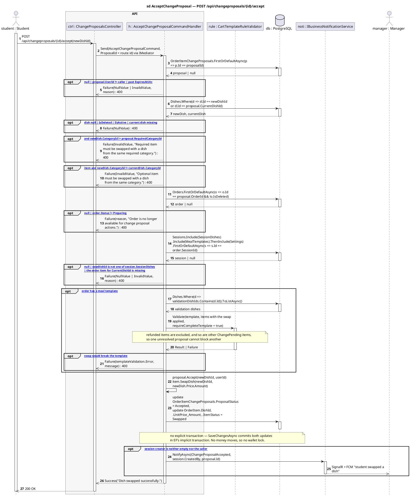
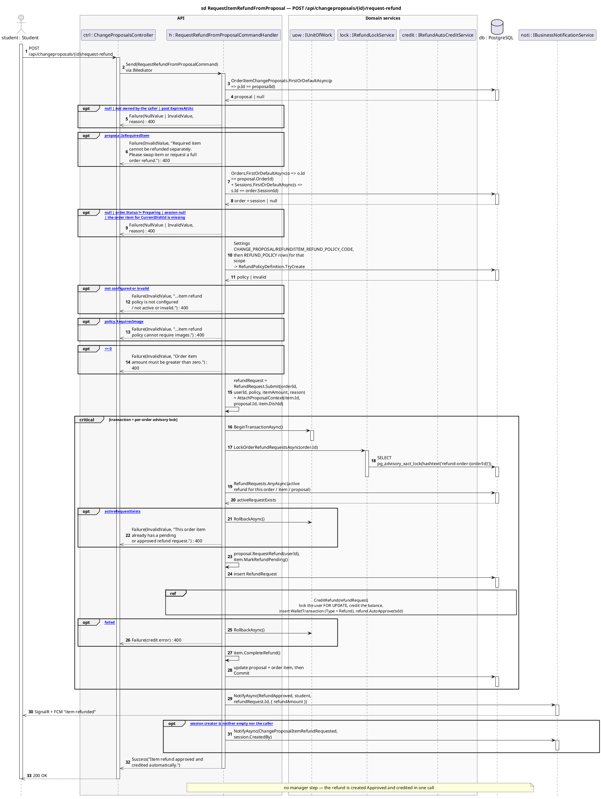
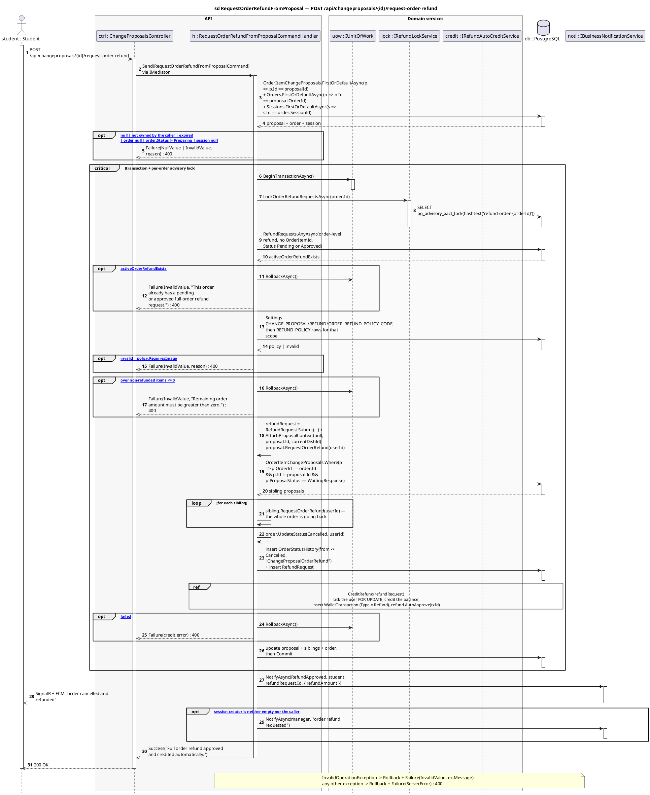
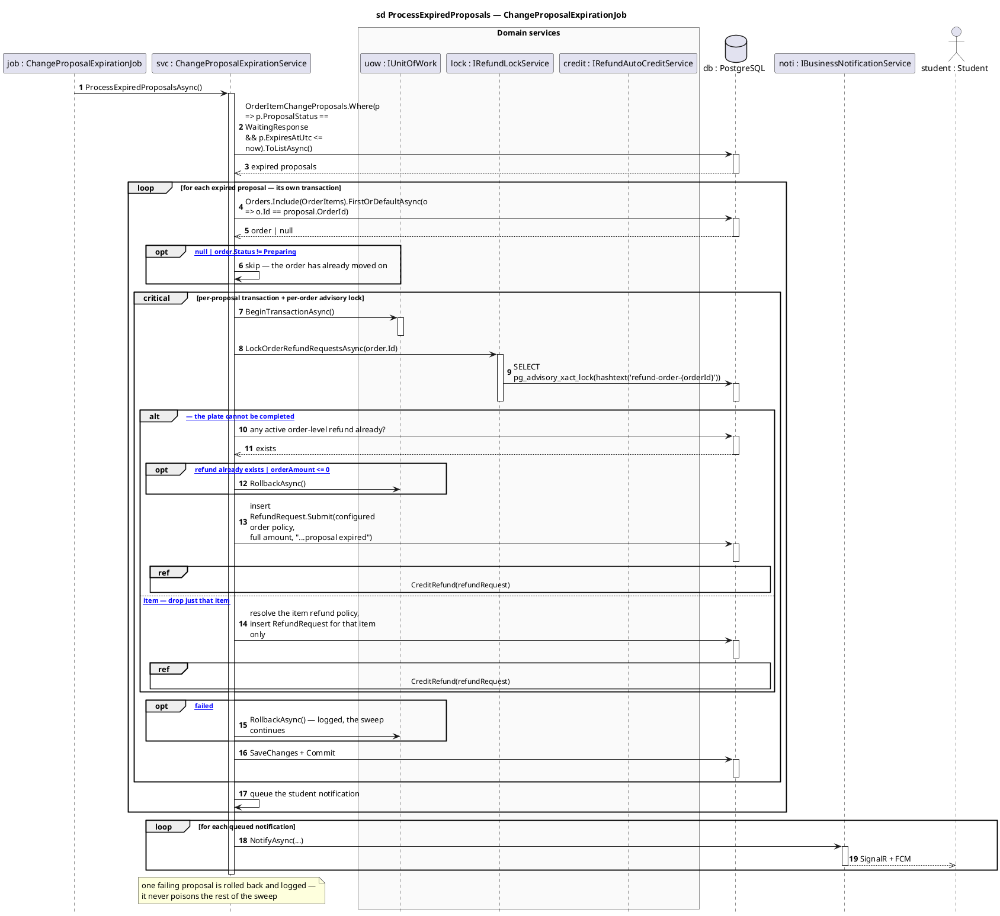
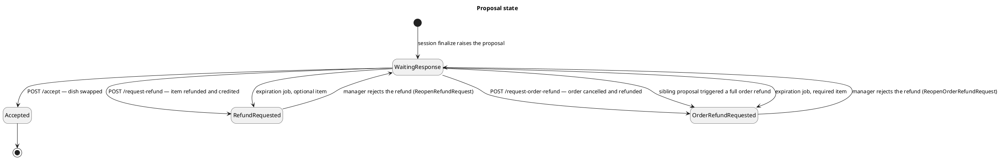

# ChangeProposalsController — Sequence Diagrams

Base route: **`/api/changeproposals`** · Auth: **JWT (the proposal's owner)** · API version `1.0`
Source: [`ChangeProposalsController.cs`](../SC.Api/Controllers/ChangeProposalsController.cs)

| Endpoint | Handler | Effect |
|---|---|---|
| `GET /api/changeproposals` | `GetMyChangeProposalsQueryHandler` | list the caller's open proposals |
| `GET /api/changeproposals/{id}` | `GetChangeProposalByIdQueryHandler` | one proposal + swap candidates |
| `POST /api/changeproposals/{id}/accept` | `AcceptChangeProposalCommandHandler` | swap the dish, order stays alive |
| `POST /api/changeproposals/{id}/request-refund` | `RequestRefundFromProposalCommandHandler` | refund **one item**, auto-credited |
| `POST /api/changeproposals/{id}/request-order-refund` | `RequestOrderRefundFromProposalCommandHandler` | cancel the order, refund **everything**, auto-credited |

**Where proposals come from:** `POST /api/sessions/{id}/finalize` creates one `OrderItemChangeProposal` per under-supplied order item and notifies the student ([`sessions-diagrams.md`](sessions-diagrams.md#2-post-apisessionsidfinalize--manual-finalize)). Each proposal carries an `ExpiresAtUtc` from the `CHANGE_PROPOSAL / RESPONSE / RESPONSE_WINDOW_MINUTES` setting (default 30 min).

**Layers:** `ChangeProposalsController → IMediator → Handler → IRefundLockService / IRefundAutoCreditService / IGenericRepository → SmartCanteenDbContext → PostgreSQL`

**Shared guards** — all three write endpoints reject in this order before doing any work:

| Guard | Message |
|---|---|
| proposal exists | `Proposal not found.` |
| `proposal.UserId == caller` | `This proposal does not belong to you.` |
| not past `ExpiresAtUtc` | `Change proposal has expired.` |
| order exists and `Status == Preparing` | `Order is no longer available for change proposal actions.` |

---

## 1. `POST /{id}/accept` — swap the dish

The replacement is re-validated against the **session**, the order's **meal template**, and the required-category rule — a swap may not turn a valid plate into an invalid one.

---

## 2. `POST /{id}/request-refund` — refund one item

Only for **optional** items. Money moves, so this runs in an explicit transaction behind a per-order advisory lock, and the refund is **auto-approved and credited immediately** — no manager step.

---

## 3. `POST /{id}/request-order-refund` — cancel the order, refund everything

The largest handler in the codebase (279 LOC, 18 dependencies). It cancels the order, **closes every sibling proposal on the same order**, refunds the remaining (non-refunded) amount, and auto-credits it.

---

## 4. Background: the student never answers

`ChangeProposalExpirationJob` sweeps proposals whose `ExpiresAtUtc` has passed while still `WaitingResponse`. Each proposal runs in **its own transaction** so one failure does not poison the sweep.
Source: [`ChangeProposalExpirationService.cs`](../SC.Persistence/Database/Services/ChangeProposalExpirationService.cs)

---

## Proposal state

> The two "reopen" edges come from [`refundmanager-diagrams.md`](refundmanager-diagrams.md) — rejecting a proposal-linked refund puts the proposal back in front of the student and restores the order to `Preparing`.

---

## Related

- [`refunds-diagrams.md`](refunds-diagrams.md) · [`refundmanager-diagrams.md`](refundmanager-diagrams.md) · [`cart-diagrams.md`](cart-diagrams.md)
- [`API-Modules/change-proposal-api.md`](../API-Modules/change-proposal-api.md) — request/response reference
- [`API-Modules/change-proposal-refund-flow.md`](../API-Modules/change-proposal-refund-flow.md) — prose walkthrough of the same flow
