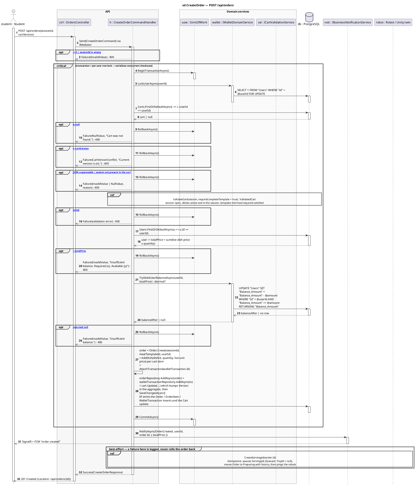
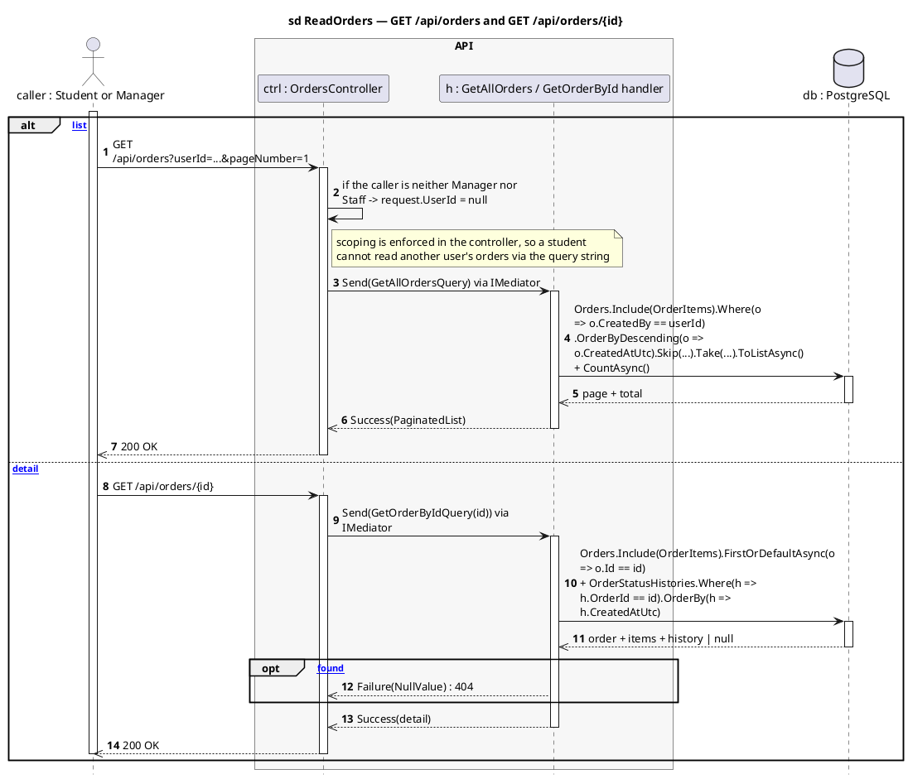
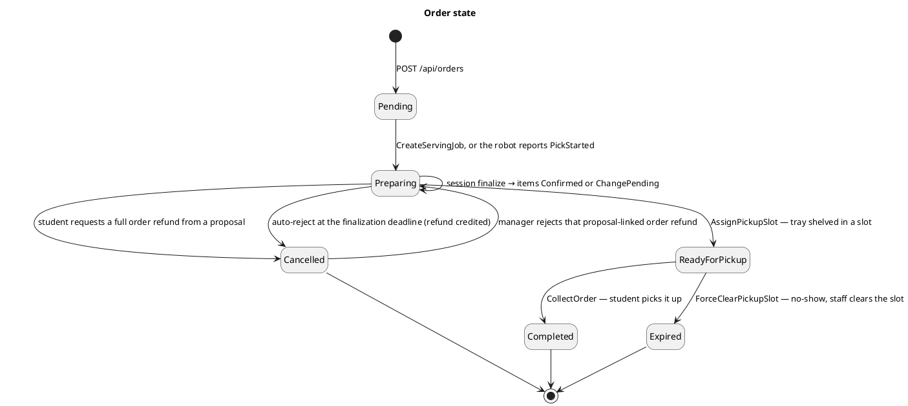

# OrdersController — Sequence Diagrams

Base route: **`/api/orders`** · Auth: **JWT** · API version `1.0`
Source: [`OrdersController.cs`](../SC.Api/Controllers/OrdersController.cs)

| Endpoint | Handler | Notes |
|---|---|---|
| `POST /api/orders` | `CreateOrderCommandHandler` | checkout — the only complex path here |
| `GET /api/orders` | `GetAllOrdersQueryHandler` | non-`Manager`/`Staff` callers are forced to their own orders |
| `GET /api/orders/{id}` | `GetOrderByIdQueryHandler` | order + items + status history |
| `DELETE /api/orders/{id}` | `DeleteOrderCommandHandler` | soft delete |

Related controller: `OrderManagerController` (`/api/manager/orders`, roles `Manager,Staff`) exposes read-by-session and `PUT /{id}/status`, which **refuses** to set serving-flow statuses so it cannot collide with the robot pipeline.

**Layers:** `OrdersController → IMediator → CreateOrderCommandHandler → ICartValidationService / IWalletDomainService / IGenericRepository → SmartCanteenDbContext → PostgreSQL`

---

## 1. `POST /api/orders` — checkout one session from the cart

Checkout takes **one session** out of the server-side cart: validate the plate against the session's meal template, debit the wallet, write the order, remove that session from the cart — all in one transaction — then queue a robot serving job as best-effort work outside it.

**Request:** `{ "sessionId": "guid", "cartVersion": 7 }` — `cartVersion` is optimistic concurrency; a stale value returns `409` and the FE must reload the cart.

**Success:** `201 Created` + `{ id, transactionId, totalPrice, userRemainingBalance, cartVersion }`.

**Failure mapping.** `DbUpdateConcurrencyException` → rollback + `CartVersionConflict` → `409`; any other exception → rollback + `ServerError` → `400`.

**Why the debit cannot go negative.** `TryDebitUserBalanceAsync` guards its UPDATE with `AND "Balance_Amount" >= @amount` and returns the new balance via `RETURNING`. If two checkouts race past the earlier balance check, the second one matches no row and comes back `null` — that is the real defence, not the `user.Balance < totalPrice` comparison above it.

Note the tray is **not** assigned at this point — the serving job is queued with `TrayId = NULL` and a tray is bound later when the edge controller scans a physical tray.

---

## 2. `GET /api/orders` and `GET /api/orders/{id}` — read paths

The controller enforces scoping before the handler runs: a caller who is neither `Manager` nor `Staff` has `request.UserId` reset to `null`, so the handler falls back to the authenticated user and cannot read someone else's orders by passing a `userId` query parameter.

---

## Order state

`OrderStatus` values (`SC.Domain/Domain/Order/Enum/OrderStatus.cs`): `Pending = 0`, `ReadyForPickup = 1`, `Completed = 2`, `Cancelled = 3`, `Preparing = 4`, `Expired = 7`.

The `Preparing → ReadyForPickup → Completed | Expired` leg belongs to the robot serving and pickup controllers, which are not diagrammed yet — see [`../API-Modules/sequence-diagram-candidates.md`](../API-Modules/sequence-diagram-candidates.md).

---

## Related

- [`cart-diagrams.md`](cart-diagrams.md) — where the `cartVersion` comes from
- [`sessions-diagrams.md`](sessions-diagrams.md) — finalize, which decides each item's fate
- [`changeproposals-diagrams.md`](changeproposals-diagrams.md) — the `Preparing → Cancelled` edge
- [`payments-diagrams.md`](payments-diagrams.md) — how the balance got there
- [`../API-Modules/order-api.md`](../API-Modules/order-api.md) — request/response reference
