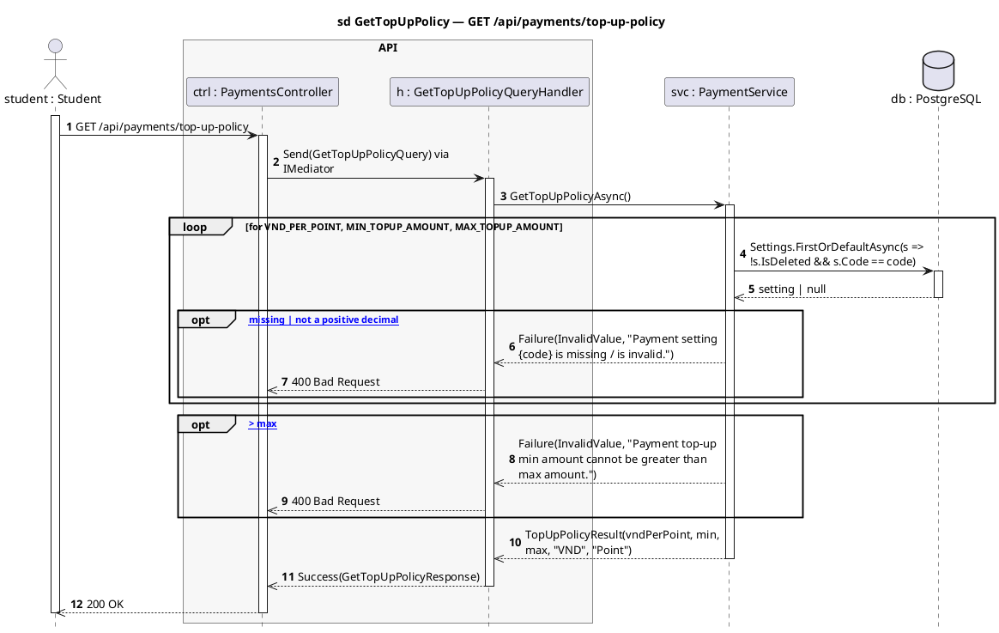
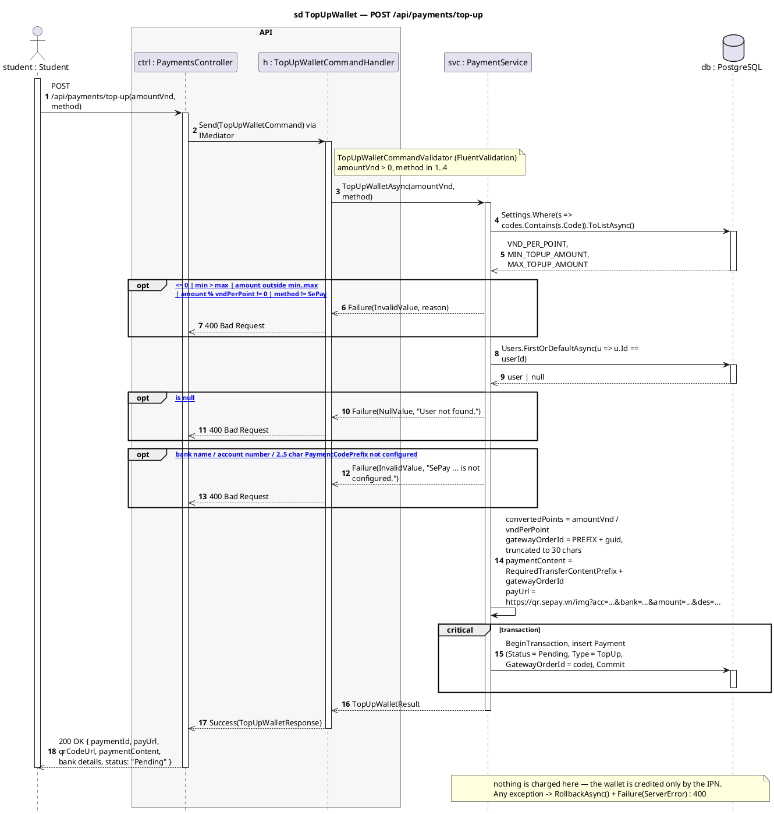
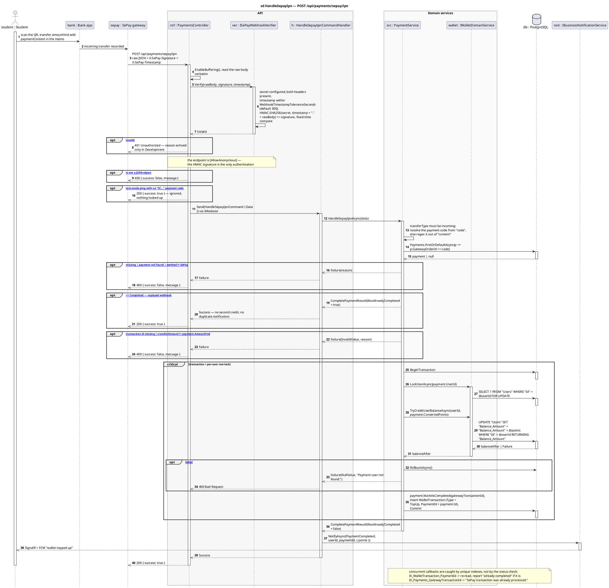
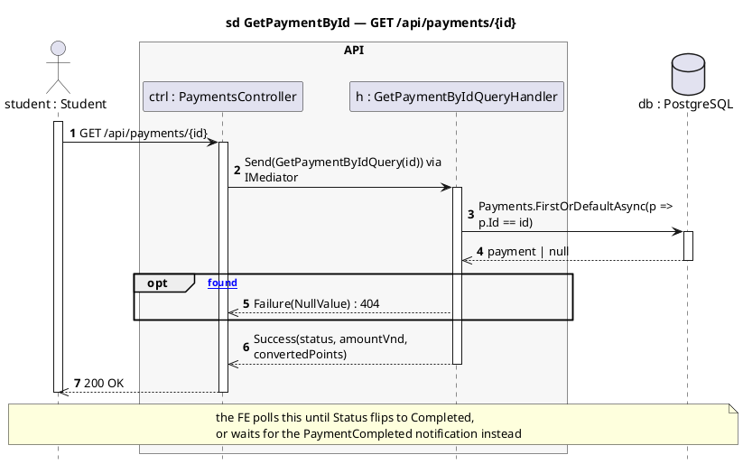
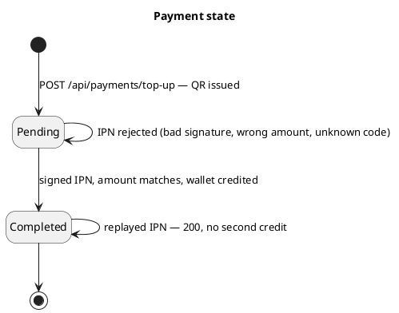

# PaymentsController — Sequence Diagrams

Base route: **`/api/payments`** · API version `1.0`
Source: [`PaymentsController.cs`](../SC.Api/Controllers/PaymentsController.cs)

| Endpoint | Auth | Handler | Purpose |
|---|---|---|---|
| `GET /api/payments/top-up-policy` | JWT | `GetTopUpPolicyQueryHandler` | `vndPerPoint`, min/max amount, currency, point name |
| `GET /api/payments/{id}` | JWT | `GetPaymentByIdQueryHandler` | poll one payment's status |
| `POST /api/payments/top-up` | JWT | `TopUpWalletCommandHandler` | create a `Pending` payment + VietQR |
| `POST /api/payments/sepay/ipn` | **anonymous** | `HandleSepayIpnCommandHandler` | SePay webhook — credits the wallet |

Wallet top-up is **two-legged**: the API creates a `Pending` payment and a QR image, the student transfers the money in their banking app, and SePay calls back over an HMAC-signed webhook that actually credits the balance. The API never sees the bank transaction directly.

**Layers:** `PaymentsController → ISePayWebhookVerifier / IMediator → Handler → IPaymentService → IWalletDomainService / IGenericRepository → SmartCanteenDbContext → PostgreSQL`

**Configuration this flow depends on**

| Source | Keys |
|---|---|
| `Settings` table | `VND_PER_POINT`, `MIN_TOPUP_AMOUNT`, `MAX_TOPUP_AMOUNT` — missing values fail the call with `Payment setting {code} is missing.` |
| `appsettings` `SePay` section | `WebhookSecret`, `BankName`, `BankAccountNumber`, `BankAccountName`, `PaymentCodePrefix`, `WebhookTimestampToleranceSeconds`, `QrTemplate` |

---

## 1. `GET /api/payments/top-up-policy` — read the limits

---

## 2. `POST /api/payments/top-up` — create the pending payment

Nothing is charged here. The handler validates the amount against the policy, generates a payment code, builds a VietQR URL, and stores a `Pending` payment row.

**Request:** `{ "amountVnd": 100000, "method": 1 }` — `method` must be `SePay`; `FluentValidation` requires `amountVnd > 0` and `method` in `1..4`, and the service then rejects any method other than SePay.

The FE then shows the QR and polls `GET /api/payments/{id}` (or waits for the `PaymentCompleted` notification) until the status flips to `Completed`.

---

## 3. `POST /api/payments/sepay/ipn` — the webhook that actually credits

`[AllowAnonymous]`, so **the HMAC signature is the only authentication**. The controller verifies it against the raw request body before any parsing, and the handler is idempotent: a replayed callback returns `200` without crediting twice.

**Idempotency, in order of defence**

1. `payment.Status == Completed` — the cheap check, catches sequential replays.
2. `IX_WalletTransaction_PaymentId` unique index — catches two callbacks racing inside overlapping transactions; the loser re-reads the payment and, if it is now `Completed`, reports success.
3. `IX_Payments_GatewayTransactionId` unique index — catches one bank transaction being applied to two different payments.

---

## 4. `GET /api/payments/{id}` — poll status

---

## Payment state

---

## Related

- [`orders-diagrams.md`](orders-diagrams.md) — where the credited points get spent
- [`refundmanager-diagrams.md`](refundmanager-diagrams.md) — the other writer of `WalletTransaction`
- [`../API-Modules/payment-api.md`](../API-Modules/payment-api.md) — request/response reference
- [`../SETUP.md`](../SETUP.md) — the `SePay` configuration keys this flow needs
