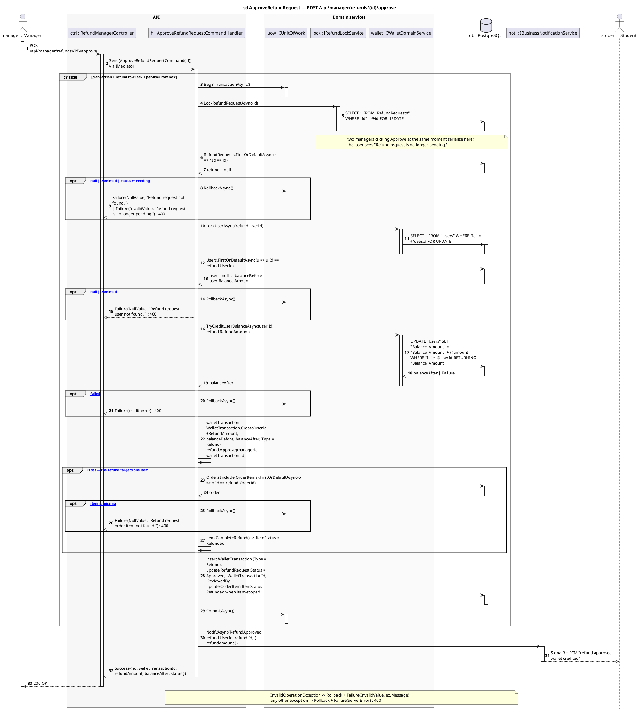
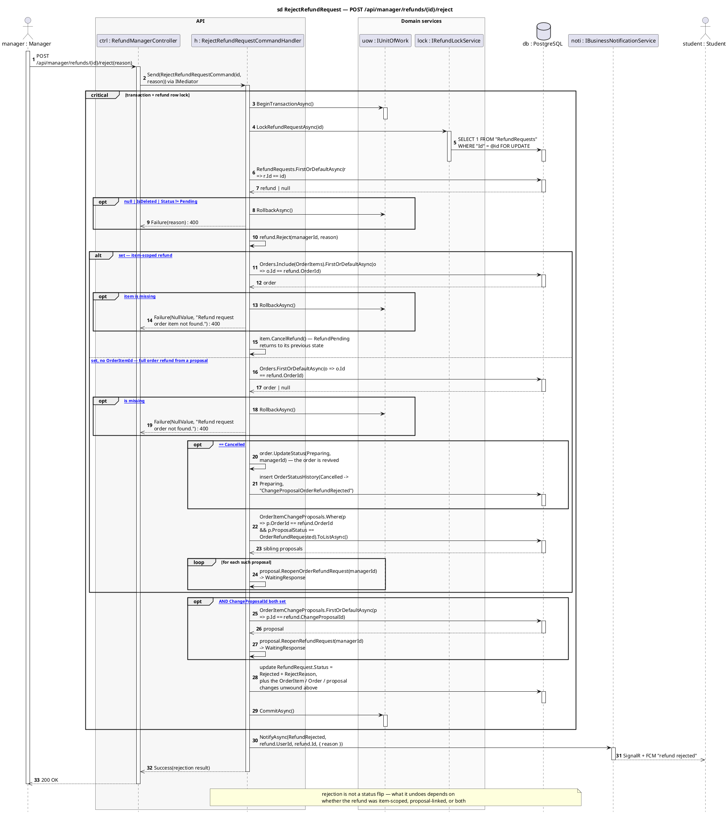
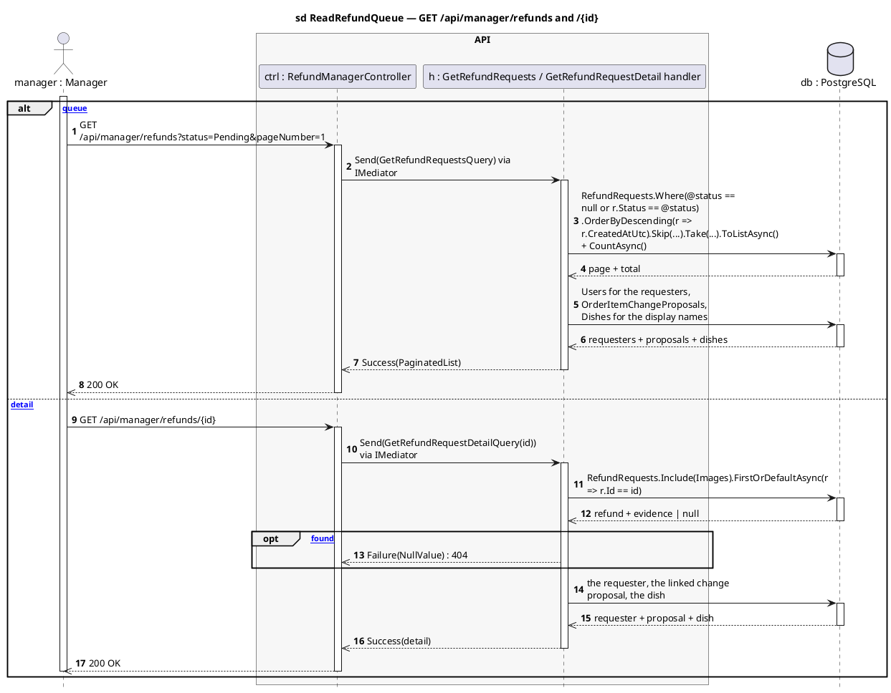

# RefundManagerController — Sequence Diagrams

Base route: **`/api/manager/refunds`** · Auth: **JWT, role `Manager`** · API version `1.0`
Source: [`RefundManagerController.cs`](../SC.Api/Controllers/RefundManagerController.cs)

| Endpoint | Handler | Effect |
|---|---|---|
| `GET /api/manager/refunds` | `GetRefundRequestsQueryHandler` | queue of requests, filterable by status |
| `GET /api/manager/refunds/{id}` | `GetRefundRequestDetailQueryHandler` | one request + order + evidence images |
| `POST /api/manager/refunds/{id}/approve` | `ApproveRefundRequestCommandHandler` | **credits the wallet** |
| `POST /api/manager/refunds/{id}/reject` | `RejectRefundRequestCommandHandler` | records a reason and **undoes** the side effects |

Both write endpoints open the transaction **first** and take a `FOR UPDATE` lock on the refund row **before** reading it — two managers clicking Approve at the same moment serialize, and the loser sees `Refund request is no longer pending.`

**Layers:** `RefundManagerController → IMediator → Handler → IRefundLockService / IWalletDomainService / IGenericRepository → SmartCanteenDbContext → PostgreSQL`

---

## 1. `POST /{id}/approve` — credit the wallet

---

## 2. `POST /{id}/reject` — record a reason and unwind

Rejection is not just a status flip. What it undoes depends on **what the refund was attached to** — and rejecting a proposal-linked order refund brings the cancelled order back to life.

**The three unwind shapes, side by side**

| Refund shape | `OrderItemId` | `ChangeProposalId` | What reject undoes |
|---|---|---|---|
| Plain order refund (student-submitted) | — | — | status only |
| Item refund | set | — | `item.CancelRefund()` |
| Item refund from a proposal | set | set | `item.CancelRefund()` **and** proposal back to `WaitingResponse` |
| Full order refund from a proposal | — | set | order `Cancelled → Preparing` + history, **every** `OrderRefundRequested` proposal on that order back to `WaitingResponse` |

> Note the asymmetry with change-proposal refunds: those are **auto-approved and credited on creation**, so they never sit in `Pending` and a manager never sees them in this queue. The reject paths above exist for proposal-linked refunds that were created `Pending` by other routes.

---

## 3. `GET` — queue and detail

---

## Related

- [`refunds-diagrams.md`](refunds-diagrams.md) — how a request gets into this queue
- [`changeproposals-diagrams.md`](changeproposals-diagrams.md) — the auto-credited refunds that bypass this queue, and the proposal states this controller can reopen
- [`API-Modules/refund-api.md`](../API-Modules/refund-api.md) — request/response reference
