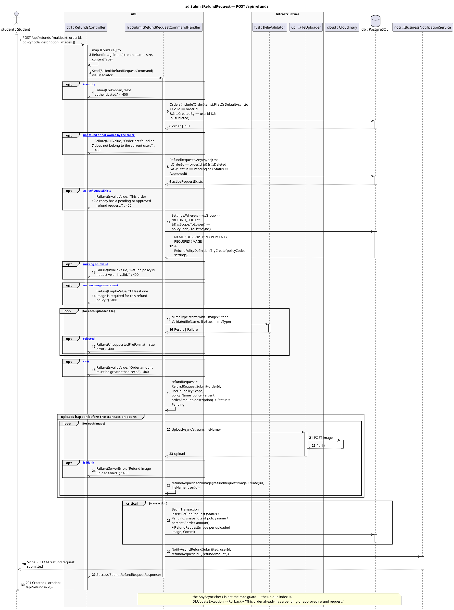
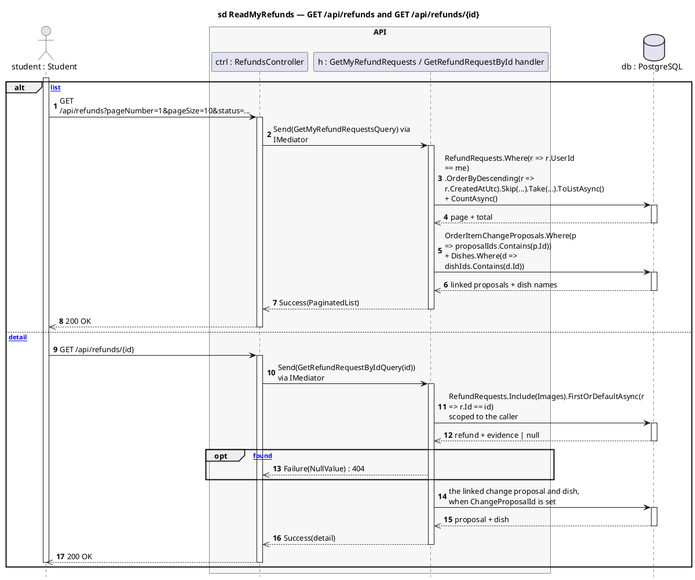
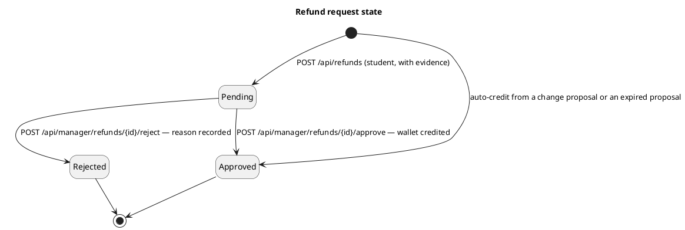

# RefundsController — Sequence Diagrams

Base route: **`/api/refunds`** · Auth: **JWT (any authenticated user)** · API version `1.0`
Source: [`RefundsController.cs`](../SC.Api/Controllers/RefundsController.cs)

| Endpoint | Handler | Notes |
|---|---|---|
| `POST /api/refunds` | `SubmitRefundRequestCommandHandler` | `multipart/form-data` — the only endpoint here that writes |
| `GET /api/refunds` | `GetMyRefundRequestsQueryHandler` | paginated, scoped to the caller |
| `GET /api/refunds/{id}` | `GetRefundRequestByIdQueryHandler` | `404` if not found |

This is the **student-initiated** refund path: submit evidence, wait for a manager. It always lands in `Pending`.

> Not to be confused with the **auto-credited** refunds raised from a change proposal — those skip the manager entirely and land in `Approved` in one call. See [`changeproposals-diagrams.md`](changeproposals-diagrams.md).

**Layers:** `RefundsController → IMediator → SubmitRefundRequestCommandHandler → IFileValidator / IFileUploader (Cloudinary) / IGenericRepository → SmartCanteenDbContext → PostgreSQL`

---

## 1. `POST /api/refunds` — submit a refund request

Order of operations matters here: **every** guard and validation runs *before* any image is uploaded, and the upload happens *before* the transaction opens. An invalid request never reaches Cloudinary, and a Cloudinary failure never leaves a half-written transaction.

**The `ExistsAsync` check is not the race guard.** Two submissions racing on the same order both pass it; the unique index on `RefundRequests` is what stops the second one, and the resulting `DbUpdateException` is rolled back and reported as `This order already has a pending or approved refund request.`

**Why the policy values are snapshotted.** `RefundRequest` stores `PolicyNameSnapshot`, `RefundPercentSnapshot` and `OrderAmountSnapshot` at submit time, so a manager editing the policy later never changes the amount owed on an already-submitted request.

---

## 2. `GET /api/refunds` and `GET /api/refunds/{id}` — read paths

---

## Refund request state

Only the `Pending → Approved | Rejected` edges are the manager's; see [`refundmanager-diagrams.md`](refundmanager-diagrams.md).

---

## Related

- [`refundmanager-diagrams.md`](refundmanager-diagrams.md) — the approve/reject half of this lifecycle
- [`changeproposals-diagrams.md`](changeproposals-diagrams.md) — the auto-credited entry into `Approved`
- [`API-Modules/refund-api.md`](../API-Modules/refund-api.md) · [`API-Modules/refundpolicy-api.md`](../API-Modules/refundpolicy-api.md)
