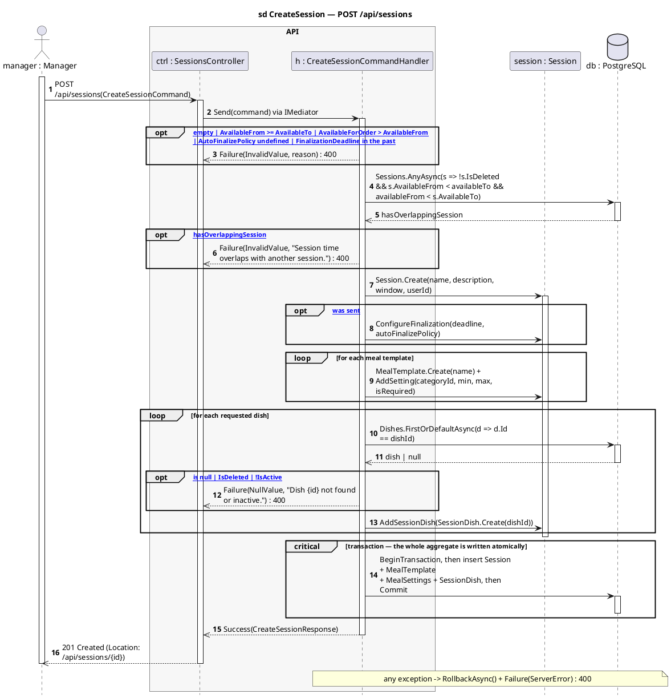
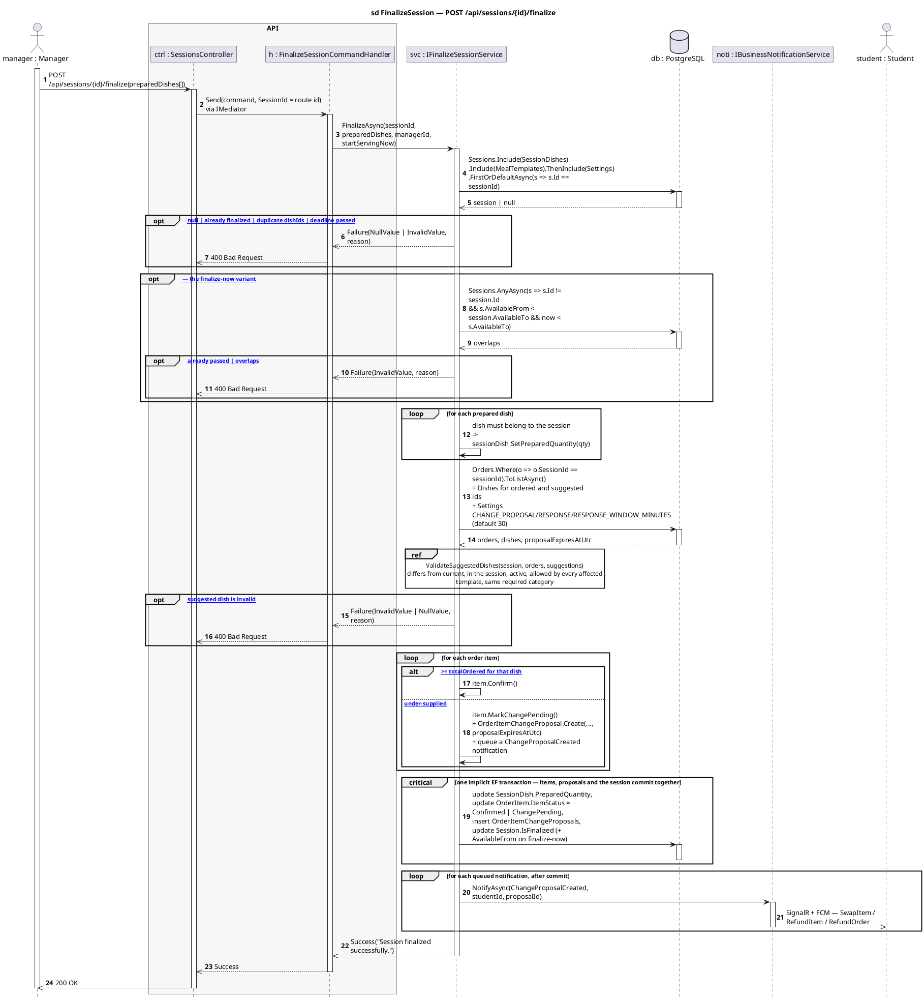
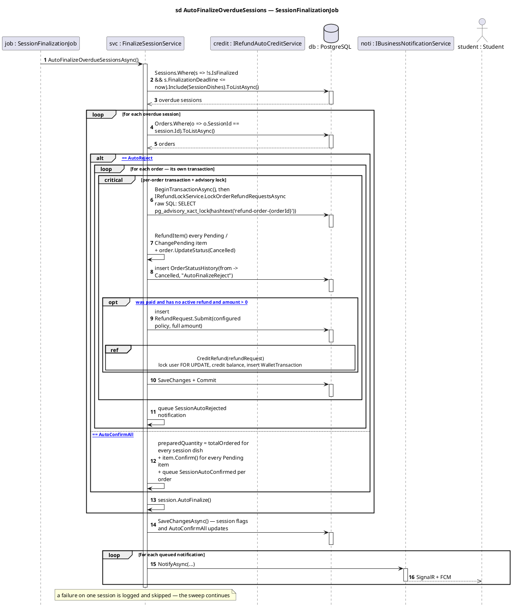
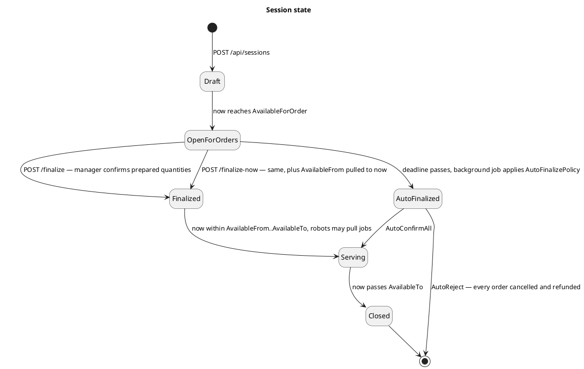

# SessionsController — Sequence Diagrams

Base route: **`/api/sessions`** · API version `1.0`
Source: [`SessionsController.cs`](../SC.Api/Controllers/SessionsController.cs)

| Endpoint | Auth | Handler | Diagrammed |
|---|---|---|---|
| `GET /api/sessions` | anonymous | `GetAllSessionsQueryHandler` | — paginated read |
| `GET /api/sessions/calendar` | anonymous | `GetSessionCalendarQueryHandler` | — day-by-day counts for a year |
| `GET /api/sessions/{id}` | anonymous | `GetSessionByIdQueryHandler` | — session + meal settings |
| `POST /api/sessions` | JWT | `CreateSessionCommandHandler` | [§1](#1-post-apisessions--create-a-session) |
| `PUT /api/sessions/{id}` | JWT | `UpdateSessionCommandHandler` | — see the note below |
| `DELETE /api/sessions/{id}` | JWT | `DeleteSessionCommandHandler` | — soft delete |
| `POST /api/sessions/{id}/finalize` | **`Manager`** | `FinalizeSessionCommandHandler` | [§2](#2-post-apisessionsidfinalize--manual-finalize) |
| `POST /api/sessions/{id}/finalize-now` | **`Manager`** | `FinalizeSessionNowCommandHandler` | [§2](#2-post-apisessionsidfinalize--manual-finalize) (same diagram, `startServingNow: true`) |
| *(background)* `SessionFinalizationJob` | — | `FinalizeSessionService.AutoFinalizeOverdueSessionsAsync` | [§3](#3-background--auto-finalize-at-the-deadline) |

**Layers:** `SessionsController → IMediator → Handler → IFinalizeSessionService / IGenericRepository → SmartCanteenDbContext → PostgreSQL`

> `PUT /api/sessions/{id}` is 200 LOC with 14 guarded branches (blocks editing a finalized session, shrinking a window that already has orders, template edits that would invalidate existing orders). It is flagged as a diagram candidate in [`../API-Modules/sequence-diagram-candidates.md`](../API-Modules/sequence-diagram-candidates.md) but is not drawn yet.

---

## 1. `POST /api/sessions` — create a session

A session bundles the serving window, the **meal templates** (per-category min/max/required rules a plate must satisfy) and the **dish list**. All validation is fail-fast, and the whole graph is written in one transaction.

**Request body**

```json
{
  "name": "Lunch 2026-08-11",
  "description": "Standard lunch session",
  "availableFrom": "2026-08-11T04:00:00Z",
  "availableTo": "2026-08-11T06:00:00Z",
  "availableForOrder": "2026-08-10T00:00:00Z",
  "finalizationDeadline": "2026-08-11T03:00:00Z",
  "autoFinalizePolicy": 1,
  "mealTemplates": [
    {
      "name": "Standard plate",
      "settings": [
        { "categoryId": "guid", "minQuantity": 1, "maxQuantity": 2, "isRequired": true }
      ]
    }
  ],
  "dishes": [{ "dishId": "guid" }]
}
```

**Success:** `201 Created` + `Location: /api/sessions/{id}` — every validation failure returns `400`.



The overlap predicate is half-open: `s.AvailableFrom < availableTo && availableFrom < s.AvailableTo`. A session that ends exactly when another starts is therefore allowed.

---

## 2. `POST /api/sessions/{id}/finalize` — manual finalize

The manager confirms how many portions of each dish were actually cooked. Items fully covered by the prepared quantity are **confirmed**; under-supplied items are marked `ChangePending` and get an `OrderItemChangeProposal` the student must answer.

**`/finalize-now`** is the identical handler with `startServingNow: true` — it additionally pulls `AvailableFrom` to now so already-queued serving jobs become eligible for robot pickup immediately. The two extra guards it adds are marked in the diagram.

**Request body**

```json
{
  "preparedDishes": [
    { "dishId": "guid", "preparedQuantity": 40, "suggestedDishId": "guid | null" }
  ]
}
```

**Success:** `200 OK` — all failures return `400`. Full error table: [`../API-Modules/finalize-session-now-api.md`](../API-Modules/finalize-session-now-api.md).



The `finalize-now` overlap guard checks the **widened** window `[now, AvailableTo]` against every other session's *full* `[AvailableFrom, AvailableTo]` — `x.Id != session.Id && x.AvailableFrom < session.AvailableTo && now < x.AvailableTo`. Checking full windows rather than "who is active right now" also catches a session that has not started yet but would start inside the widened window.

Each proposal raised here is answered in [`changeproposals-diagrams.md`](changeproposals-diagrams.md).

---

## 3. Background — auto-finalize at the deadline

If the manager never finalizes, `SessionFinalizationJob` applies the session's `AutoFinalizePolicy` once `FinalizationDeadline` passes. **AutoReject** cancels every order and auto-credits a full refund; **AutoConfirmAll** treats the ordered quantity as the prepared quantity and confirms everything.



---

## Session state



---

## Related

- [`orders-diagrams.md`](orders-diagrams.md) — the orders this session finalizes
- [`changeproposals-diagrams.md`](changeproposals-diagrams.md) — what happens to the proposals raised in §2
- [`../API-Modules/session-api.md`](../API-Modules/session-api.md) · [`../API-Modules/finalize-session-now-api.md`](../API-Modules/finalize-session-now-api.md)
