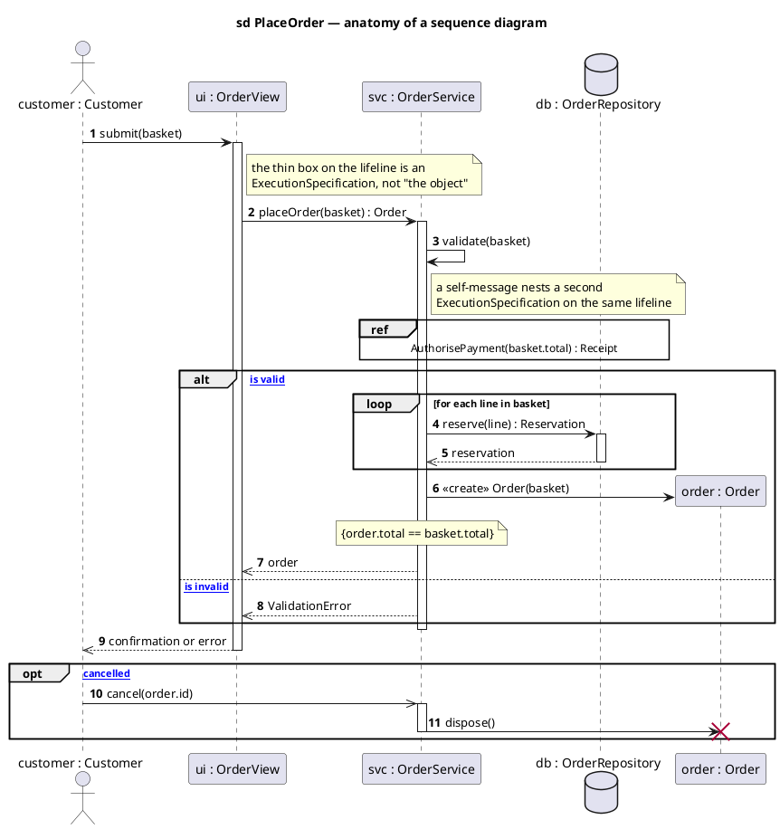
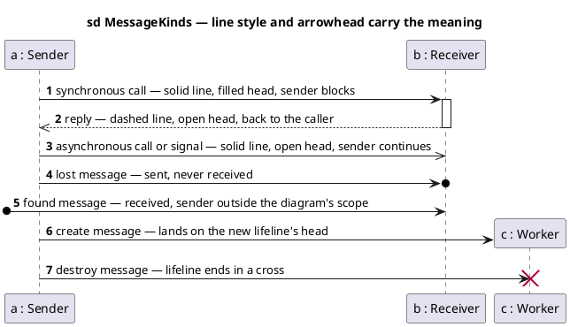

# What a Sequence Diagram Actually Is — UML 2.5.1 Concepts

Reference for the notation used in this folder, checked against the OMG UML 2.5.1 specification and the standard notation references. Read this before arguing about an arrowhead.

- [1. The idea](#1-the-idea)
- [2. The metamodel](#2-the-metamodel)
- [3. Notation catalogue](#3-notation-catalogue)
- [4. Drawing: anatomy of a sequence diagram](#4-drawing-anatomy-of-a-sequence-diagram)
- [5. Drawing: the seven message kinds](#5-drawing-the-seven-message-kinds)
- [6. Combined fragment operators](#6-combined-fragment-operators)
- [7. PlantUML ↔ UML mapping](#7-plantuml--uml-mapping)
- [8. Where this folder deviates](#8-where-this-folder-deviates)

---

## 1. The idea

A sequence diagram is one concrete syntax for a UML **Interaction** — a unit of behaviour that describes *how a set of participants exchange messages over time*.

Three things follow from that definition, and most bad sequence diagrams get one of them wrong:

**It shows traces, not an algorithm.** An Interaction defines a set of valid **traces** — sequences of event occurrences. It is a *partial* specification: it says "these exchanges are valid", not "this is everything the system does". If you need complete behaviour for one object, that is a state machine, not a sequence diagram.

**The ordering is partial, not total.** Vertical position does *not* mean global time. UML guarantees only two orderings:

1. occurrences on the **same lifeline** are ordered top to bottom, and
2. a message's **send** occurrence always precedes its **receive** occurrence.

Two messages on unrelated lifelines have no defined order, even if one is drawn higher. This is why `par` exists and why "it's higher so it happens first" is a bug in your reading, not in the diagram.

**Time flows down, but the axis is not a scale.** Spacing carries no duration meaning unless you attach an explicit duration or time constraint.

---

## 2. The metamodel

The elements you draw map onto these metaclasses:

| You draw | Metaclass | Meaning |
|---|---|---|
| the frame | `Interaction` | the whole behaviour being specified |
| a labelled box + vertical line | `Lifeline` | **one** participant (an object/role), for its lifetime |
| a thin rectangle on the line | `ExecutionSpecification` | a period during which the participant is doing something |
| the ends of that rectangle | `ExecutionOccurrenceSpecification` | start and finish events |
| an arrow | `Message` | a communication between two lifelines |
| each end of the arrow | `MessageOccurrenceSpecification` | the send event and the receive event |
| a boxed region with an operator | `CombinedFragment` | control logic over the enclosed fragments |
| each compartment inside it | `InteractionOperand` | one branch/body, optionally with a guard |
| the guard in `[ ]` | `InteractionConstraint` | when that operand applies |
| a `ref` box | `InteractionUse` | "expand another Interaction here" |
| a small square on the frame edge | `Gate` | a message crossing the frame boundary |

A `Lifeline` represents **exactly one** participant. A box labelled "the repositories" is not a lifeline in the UML sense — it is a drawing convenience.

---

## 3. Notation catalogue

| Element | Notation |
|---|---|
| **Lifeline** | rectangle head + vertical line (dashed while inactive). Name is `roleName : Type` — `order : Order`. Type only (`: Order`) is anonymous; name only (`order`) is untyped. |
| **Execution specification** | thin rectangle on the lifeline. Overlapping/offset rectangles = nested execution (self-call, recursion, re-entrancy). |
| **Synchronous call** | **solid** line, **filled** arrowhead. Caller blocks. |
| **Asynchronous call / signal** | **solid** line, **open (stick)** arrowhead. Caller continues. |
| **Reply** | **dashed** line, **open (stick)** arrowhead. Must return to the sender of the call it answers. |
| **Create message** | **dashed** line, open arrowhead, landing on the **head** of the created lifeline (which is drawn lower). |
| **Destroy message** | solid line ending in a **✗** (destruction occurrence); the lifeline stops there. |
| **Lost message** | solid arrow ending in a filled **circle** — sent, never received. |
| **Found message** | solid arrow starting from a filled **circle** — received, sender unknown/outside scope. |
| **Message signature** | `attribute = name(arguments) : returnValue` — `name` should be an **operation or signal of the receiving lifeline's type**. |
| **Guard** | boolean in **square brackets**, at the top-left of the operand: `[balance >= total]`. |
| **State invariant** | constraint in **curly braces** on a lifeline: `{balance > 0}` — must hold at that point. |
| **Interaction use** | frame labelled `ref`, body `[attr =] interactionName(args) : return`. |
| **Duration / time constraint** | `{d..3*d}` beside a message, or `{t = now}` on a lifeline. |
| **Diagram frame** | rectangle with a pentagon tag reading `sd <InteractionName>`. |

**The single most-broken rule:** a reply is *dashed with an open head*, and it goes back to **the lifeline that sent the call**. A dashed arrow to some third party is not a reply — it is a differently-drawn message, and it means something else.

---

## 4. Drawing: anatomy of a sequence diagram

Every numbered element is a distinct UML concept.

Reading it as UML:

| Seen | Concept |
|---|---|
| `customer : Customer` | a **named, typed** lifeline |
| the boxes on the lifelines | **ExecutionSpecifications** |
| `submit(basket)` with a filled head | **synchronous call** |
| `reservation` dashed, open head, back to `svc` | **reply**, returning to the caller |
| `validate(basket)` looping to itself | **self-message**, nested execution |
| `ref … AuthorisePayment(...)` | **InteractionUse** — a whole interaction referenced, not repeated |
| `alt` / `else` with `[ … ]` | **CombinedFragment** with two guarded **InteractionOperands** |
| `new Order(basket)` landing on a lower lifeline head | **create message** |
| `{order.total == basket.total}` | **state invariant** |
| `cancel(order.id)` with an open head | **asynchronous** message — the sender does not block |
| `dispose()` ending in ✗ | **destroy message** + destruction occurrence |

---

## 5. Drawing: the seven message kinds

The line style and the arrowhead are not decoration — they are the semantics.

The mistake that matters most in practice: drawing a reply with a **filled** head. A filled head means "synchronous call". A reply that looks like a call inverts the direction of control in the reader's head.

---

## 6. Combined fragment operators

UML 2.5.1 defines twelve interaction operators. Most diagrams only ever need the first four.

| Operator | Operands | Meaning |
|---|---|---|
| `alt` | 2+ | **Alternatives.** Exactly one operand whose guard is true executes. An `[else]` operand runs when no other guard holds. |
| `opt` | 1 | **Option.** The operand runs if its guard holds — equivalent to an `alt` with one branch. |
| `loop` | 1 | **Iteration.** `loop(min, max)`; repeats while the guard holds, at least `min` and at most `max` times. |
| `par` | 2+ | **Parallel.** Operands interleave in any order; only each operand's internal ordering is preserved. |
| `break` | 1 | **Break.** If the guard holds, run this operand *instead of* the remainder of the enclosing fragment. |
| `critical` | 1 | **Critical region.** The operand's occurrences may not be interleaved with anything else on those lifelines — this is where you show a lock or a transaction. |
| `seq` | 1+ | **Weak sequencing** — the default. Ordering is kept per lifeline only. |
| `strict` | 2+ | **Strict sequencing.** Operands run in the drawn order, globally. |
| `neg` | 1 | **Negative.** These traces are *invalid* — a counter-example. |
| `assert` | 1 | **Assertion.** The only valid continuation; anything else is a violation. |
| `ignore` | 1 | Listed message types may occur and are irrelevant: `ignore {heartbeat}`. |
| `consider` | 1 | Only the listed message types matter: `consider {commit, rollback}`. |

`critical`, `neg` and `assert` are the ones worth reaching for more than people do — `critical` in particular is the correct way to draw a database lock or a transaction boundary, which is exactly what the diagrams in this folder spend most of their time doing.

---

## 7. PlantUML ↔ UML mapping

PlantUML is not UML — it is a renderer with its own syntax, and its defaults are **not** the UML defaults. Confirmed against the PlantUML reference:

| UML concept | Correct PlantUML | Common wrong choice |
|---|---|---|
| Synchronous call | `A -> B` (solid, filled head) | — |
| Asynchronous call/signal | `A ->> B` (solid, open head) | `A -> B` |
| **Reply** | `B -->> A` (dashed, **open** head) | **`B --> A`** — dashed but **filled** head, i.e. drawn as a call |
| Execution specification | `A -> B ++` … `deactivate B`, or `B --> A --` | omitting bars entirely |
| Create | `A -> B **` (after `create B`) | a normal call to an already-drawn lifeline |
| Destroy | `A -> B !!` | — |
| Lost / found | `A ->o B` / `[o-> B` | — |
| Interaction use | `ref over A, B : Name(args)` | copy-pasting the referenced interaction |
| Guard | `alt [condition]` | `alt condition` — prose without brackets |
| Lifeline name | `participant "svc : OrderService" as SVC` | `participant "OrderService" as SVC` |
| Transaction / lock | `critical` | `group` |

**`group` is not a UML operator.** PlantUML's `group` draws a generic labelled frame with no UML meaning. If the region is a transaction or a lock, the operator is `critical`; if it is a reference to another interaction, it is `ref`; if it is just commentary, it should be a `note`.

---

## 8. Where this folder deviates

Honest audit of the 21 sequence diagrams in this folder against the above. None of these are *errors* — they are deliberate trade-offs for a code-oriented reader — but they are deviations, and you should know which is which before showing them to someone who marks against the spec.

Counts are measured across the 21 sequence diagrams, not estimated.

### Fixed

| # | Deviation | Was | Now |
|---|---|---|---|
| 1 | **Reply arrowhead.** `-->` is dashed with a **filled** head — which means "synchronous call". Every reply was drawn as a call. | 200 replies as `-->` | **200 as `-->>`** — dashed + open head, per spec |
| 2 | **Transaction regions used `group`**, which carries no UML semantics | 12 `group`, 0 `critical` | the 2 wallet-lock + credit regions are now **`critical`** |

### Outstanding

| # | Deviation | Count | Severity | Fix |
|---|---|---|---|---|
| 3 | **Replies that do not return to a caller** — e.g. `PSVC -->> CTRL` where `CTRL` called `H`, not `PSVC` | 25 | **Real** — a reply must answer the call that invoked it | route the reply back through the caller, or redraw as a plain message. Needs judgement per message. |
| 4 | **`group` used to name a sub-step** — `RemoveExpiredSessionsAsync`, `Amount rules`, `Uploads happen before the transaction opens` | 10 | Real — UML has no `group` operator | for a real helper method, a `ref` (InteractionUse) or a plain `note`; for commentary, a `note` |
| 5 | **Composite lifelines** — `"User / Order / WalletTransaction repositories"` is three participants in one box | 14 | Real — a lifeline is exactly one participant | split, or accept as a documented simplification |
| 6 | **Guards are prose, not `[bracketed]`** — `alt balance sufficient` | 78 of 78 | Cosmetic | wrap in `[ ]` |
| 7 | **Message names are SQL and prose**, not operations of the receiving lifeline | throughout | Deliberate — the SQL is the point of these diagrams | use `name(args) : return` and move the SQL to a note |
| 8 | **Lifelines are prose labels**, not `role : Type` — `"Order repository"` | all | Cosmetic | `"orders : IGenericRepository"` |
| 9 | No `sd` frame, gates, or duration constraints | — | Cosmetic / not needed | — |

Item **3** is the one a reviewer would still flag. The 10 remaining `group` frames (item 4) are a deliberate PlantUML labelling affordance: they name a private helper method whose internals are shown inline, which is exactly the case UML expects you to hide behind a `ref`. Showing the internals is the point of these diagrams, so the frame stays and the deviation is documented rather than removed.

**A further improvement not yet made:** the `BeginTransactionAsync … CommitAsync` spans are the real critical regions in most of these flows, and none of them are wrapped in a fragment at all. Enclosing each in `critical` would say "these occurrences may not be interleaved" — which is precisely what the row lock and the transaction guarantee.

The deliberate trade-off worth defending: these diagrams model the **runtime call stack of a layered .NET application**, where showing the actual SQL is more useful to the reader than a spec-perfect operation signature. That is a legitimate use of the notation — as long as it is a choice, not an accident.

---

## Sources

- [OMG — About the Unified Modeling Language Specification Version 2.5.1](https://www.omg.org/spec/UML/2.5.1/About-UML)
- [uml-diagrams.org — UML Sequence Diagrams: Graphical Notation Reference](https://www.uml-diagrams.org/sequence-diagrams-reference.html)
- [uml-diagrams.org — Sequence Diagrams overview](https://www.uml-diagrams.org/sequence-diagrams.html)
- [uml-diagrams.org — Combined Fragment](https://www.uml-diagrams.org/sequence-diagrams-combined-fragment.html)
- [Sparx Systems — Sequence Diagram, UML 2 Tutorial](https://sparxsystems.com/resources/tutorials/uml2/sequence-diagram.html)
- [PlantUML — Sequence Diagram syntax reference](https://plantuml.com/sequence-diagram)
